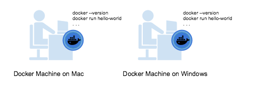
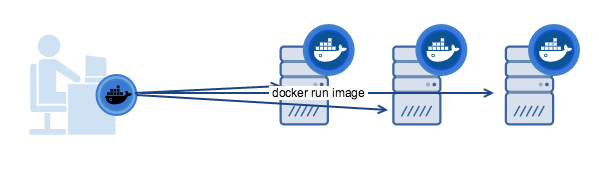

> 翻译整理自 [Docker Machine Overview](https://docs.docker.com/machine/overview/#why-should-i-use-it)

## 何为 Docker Machine

**Docker Machine 是一个能让你在虚拟机上安装 Docker Engine （即创建一个 Docker 主机）的工具**，并提供了 `docker-compose` 命令来管理这些主机。它能让你很方便地在本地计算机上、公司网络、数据中心或是云提供等（`Azure`、`AWS`等各种云服务器）上快速创建 `Docker` 主机。

<!-- more -->

> 什么是 Docker Engine 请查看下文的 “论 Docker Engine 与 Docker Machine 的区别” 一节

使用 Docker Machine 的 docker-machine 命令，我们可以很方便地启动、检查、停止和重新托管主机、升级 Docker 客户端和守护程序，并配置 Docker 客户端与主机通信。

当我们用 `Docker Machine CLI` 控制正在运行的（被管理的）主机时，你能直接在那台主机上运行 `docker` 命令。举个栗子，我们使用 `docker-compose env default` 命令能够指向一台名为 `default` 的主机，然后按照屏幕上的指令去完成 `env` 设置，然后就能运行 `docker ps`、`docker run <image>` 等等指令。

## 论 Docker Engine 与 Docker Machine 的区别

当人们说起 `Docker` 的时候（比如 `Mac` 上安装的 `Docker for Mac`），通常指的就是 `Docker Engine`，它**是由 Docker Daemon、REST API 和 命令行接口（CLI）客户端三个部分组成的（C/S）应用程序**，其中REST API 用于与 `daemon` 交互， 命令行接口（`CLI`）客户端则是接受用户用户输入命令并通过 `REST API` 包装后传递给 `daemon`。`Docekr Engine` 接受来自 `CLI` 的 `Docker` 命令，比如 `docker run <image>` 等。

**Docker Machine 是一个配置和管理 Docker 化的（安装了 Docker Engine 的主机）主机的工具**。通常，我们会在本地系统上安装 `Docker Machine`。`Docker Machine` 有它自己的命令行客户端（`docker-machine`）和 `Docker Engine` 客户端（`docker`）。

你能够使用 `Docker Machine` 在一个或者多个虚拟系统上安装 `Docker Engine`。这些虚拟系统可以是在本地的（比如我们可以在本地的 虚拟机（如`VirtualBox`）上安装或者运行 `Docker Engine`），也可以是在远程的（比如我们给云平台上的系统配置 Docker 化主机）。

> Docker 化的主机本身就会被认为是（有时也被称之为）**被管理的“机器”**。

## Docker Machine 的作用

Docker Machine 能让你在各种 Linux 机子上配置多个远程 Docker 主机。此外它还能允许你在较旧的 Mac 或者 Windows 系统上运行 Docker。

这里有两个被广泛应用的例子：

1. 希望在旧版本的桌面系统（Mac 或 Windows）运行 Docker；

你的电脑的系统比较旧，不支持安装 `Docker for Mac` 或者 `Docker for Windows`。那么你可以使用 `Docker Toolbox` 在你的系统上先安装 `Docker Machine`，然后为本机上的虚拟机配置一个 `Docker Engine`，然后你连接上去就可以运行 `docker` 命令了。

1. 在远程系统上配置 Dcoker 主机

你想在本地运行 `docker` 命令比较简单地，只在本地配置一个 `Docker Engine` 即可。但是如果现在你有十几二十个远程服务器都想要配置多个 Docker 主机，那么总不能一个个配置过去，这时候你就可以使用 `Docker Machine` 了，它能帮助你高效的完成配置。

无论您的主系统是`Mac`，`Windows`还是`Linux`，都可以在其上安装`Docker Machine`，并使用 `docker-machine` 命令来配置和管理大量的 `Docker` 主机。 它会自动创建主机，在其上安装 `Docker Engine`，然后配置 `Docker` 客户端。 每个托管主机（“机器”）是 `Docker` 主机和配置的客户机的组合。