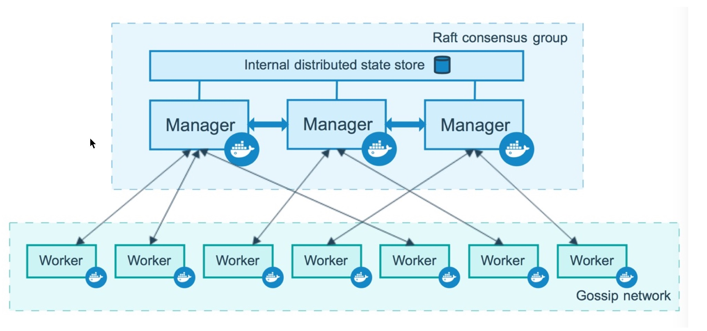
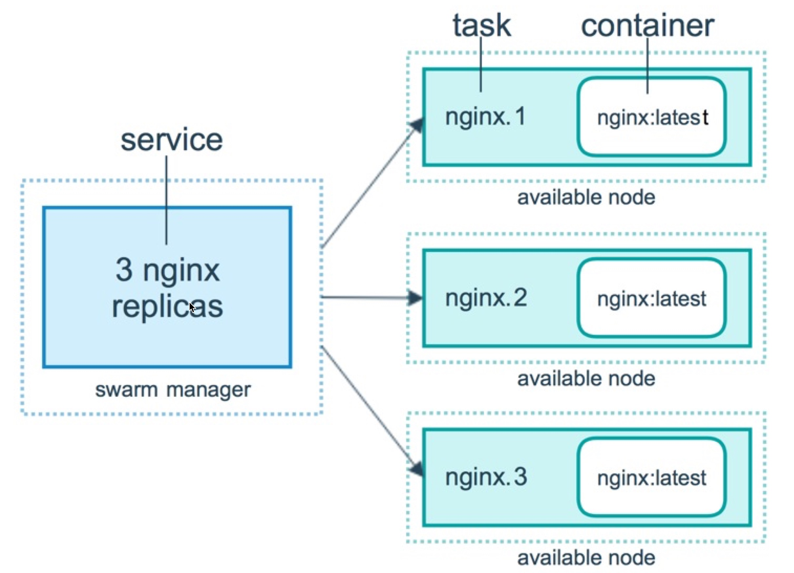

`Docker Swarm Mode` 负责提供 Docker 容器集群服务， 内置了 `kv` 存储功能，提供了众多的新特性，比如：具有容错能力的去中心化设 计、内置服务发现、负载均衡、路由网格、动态伸缩、滚动更新、安全传输等。使得 `Docker` 原生的 `Swarm` 集群具备与 `Mesos`、`Kubernetes`竞争的实力。

> 未待完续…

<!-- more -->

### 什么是 Docker Swarm Mode

> 翻译改写自 [Swarm mode key concepts](https://docs.docker.com/engine/swarm/key-concepts/#what-is-a-swarm)。

`Docker Engine` 中的集群管理和编排功能是通过 `Swarmkit` 实现的。Swarmkit 是一个独立的项目，它实现了 `Docker` 的编排层（`orchestration layer`），并能在 `Docker` 中直接使用。

一个集群（`swarm`）是由多个 Docker 主机组成，这些主机以 swarm mode 的方式运行，并分为管理节点（管理成员关系和委托的主机）和工作节点（运行 swarm 服务的主机）。一个 Docker 主机可以被指定为管理节点、工作节点或是兼顾两者的职责。你能定义它运行的任务（实例数据、网络、存储资源和对外的接口等）。`Docker Swarm Mode` 会保证集群上的服务正常运行，举个栗子：如果一个工作节点不可用了，Docker 将在其他节点上调用该节点的任务。

> 任务是一个正在运行的容器，但不是一个独立的容器，它是 swarm 服务的一部分，由一个 swarm 管理器管理。

集群服务相对于独立容器的一个主要优势是，你可以修改服务的配置（包括连接的网络和数据卷），而无需手动重新启动服务。Docker 将会自动更新配置，停止使用过期配置的服务任务，并创建与所需要配置相匹配的新服务。

当 Docker 以群集模式运行时，你仍然可以在参与集群的任何 Docker 主机以及集群服务商运行独立容器。独立容器和集群服务之间的一个重要区别是，只有集群管理员可以管理集群，而独立容器可以在任何守护进程上启动。

#### 节点

**节点是参与集群的 Docker Engine 的一个实例。你也可以认为这是一个 Docker 节点。**你可以在一个本地系统或云服务器上运行一个或多个节点，但是在生产环境下，Docker 节点的集群部署的通常会跨越多个物理机或是云机器。

节点通常分为 管理节点 和 工作节点。

1. 管理节点：

   管理节点用于 Swarm 集群节点管理，维护集群的功能（`maintain the desired state`）。一个集群可以有多个管理节点，但是只能有一个 `leader`，由它负责集群节点的编排。

   > `docker swarm` 命令只能在管理节点运行；只有节点退出命令 `docker swarm leave` 可以在工作节点执行。

2. 工作节点：

   工作节点就是任务执行节点，它接受管理节点分派的任务。工作节点上有一个代理，用于报告任务的当前状况（即执行情况）。

   > 默认情况下，管理节点也是一个工作节点，但是你也将其配置为仅运行管理服务的节点。

[SwarmNode](http://huanqiang.wang/img/DockerSwarmMode/SwarmNode.png)

这张图展示了集群中管理节点和工作节点的关系。

#### 服务与任务

任务（`Task`）是 `Swarm` 中最小的调度单位，一般指一个单一的容器（一个容器运行一个业务功能）。

服务（`Services`）是指一组任务的集合，服务定义了任务的属性。通常服务有两种模式（通过 `docker service create` 的 `--mode` 参数指定）：

- `replicated services`：按照一定的规则在各个工作节点上运行制定个数的任务；
- `global services`：指每一个工作节点上运行一个服务；

[SwarmServicesAndTasks](http://huanqiang.wang/img/DockerSwarmMode/SwarmServicesAndTasks.png)

这张图描述了服务、任务、容器、节点的关系的关系。此图描述了一个包含三个任务的 `replicated services`，由一个管理节点管理，三个工作节点分别运行三个任务，每个任务运行于一个 `nginx` 容器之中。