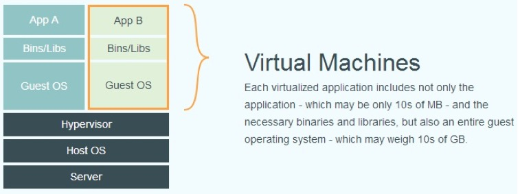
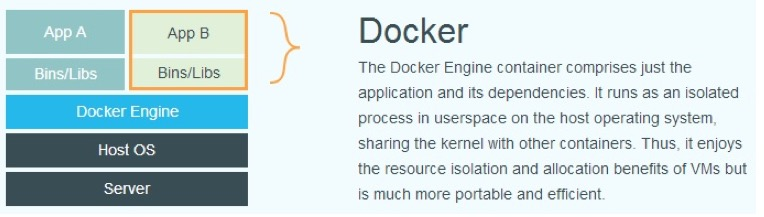

## 何为 Docker

Docker 是使用 Google 推出的 Go语言 进行开发的，基于 Linux 内核的 `cgroup`、`namespace`和 `AUFS`类的 `Union FS` 等技术，**对进程进行了封装隔离**，属于操作系统层面的虚拟化技术。

正是因为 **Docker 隔离的进程是独立于宿主（机）和其他隔离的进程**，所以我们称其为容器。Docker 在容器的基础上，进行了进一步的封装，包括了从文件系统、网络互联到进程隔离的各方面，极大的简化了容器的创建和维护。

<!-- more -->

### 何为容器技术

在现实生活中，我们也经常使用容器，比如我们在收拾厨房的时候，经常为了干净整洁高效，会将厨具和餐具分别放置在各自的抽屉里，此时的抽屉我们就可以理解为一个容器。

那么最经典的容器当属集装箱，在大型的港口，码头旁停靠在着无数的轮船，岸边堆场里也有数万个金属集装箱，集装箱内放置了大量的货物，而旁边大型起重机臂不停地吊起这些几十吨的集装箱，在几分钟内安放到集装箱船上。几小时后巨轮拔锚启航，上面承载了数千个集装箱。这是这样的集装箱的出现，将原本散乱的货物有序的放置起来，所以极大地提高了航运的效率与容量。

> Docker 的图标就是一个堆积着集装箱的巨大鲸鱼。

在以 Docker 为代表的容器技术中，应用程序/进程就是货物（散件），容器就是集装箱。

**容器为应用程序提供了一个隔离的运行空间。每个容器都包含了一个完整的、独享的用户环境，而且在该容器中进行的操作、改动不会影响到其他容器的运行环境。**

### 与传统虚拟化技术的区别（简述）

Docker 也是一种虚拟化技术，那么它与传统的虚拟机技术有什么区别呢？

#### 传统虚拟化技术

用过 Parallels、VM 等软件的人就会知道，我们在创建的虚拟机的时候，会先选择一个系统源和一套虚拟的硬件，然后这些软件就会自助地帮我们创建该系统。

所以由此我们可以看出传统虚拟化技术是先虚拟出了一套硬件系统，然后在此硬件系统上，运行了一个完整的操作系统，然后就可以使用各类软件、进程了。其实和我们的真实的电脑上操作的流程是差不多的。

[传统虚拟化技术](http://huanqiang.wang/img/Docker_Introduce/Docker_Virtual_Machines.png)

#### Docker

Docker 则不需要虚拟这样一套硬件系统，也不需要一个完整的操作系统。它将容器中的应用程序**直接运行与宿主机的内核**，容器没有自己的内核。

[Docker的虚拟化技术](http://huanqiang.wang/img/Docker_Introduce/Docker_Virtual.png)

## Docker 的三大组成

### 镜像

我们都知道，操作系统分为 **内核和用户空间**，在 Linux 中，内核在启动后，会通过 `Root 文件系统` 给操作系统提供了用户空间的支持。

而在 Docker 中，它的内核直接借助了宿主机的内核，为了让其内核和用户空间相互通讯作用，就必须要一个 `Root 文件系统` 来完成这个功能，而镜像就是相当于这个 `Root 文件系统`。

> 用户空间：存放的是用户所要运行的用户程序和数据。

#### 镜像组成

镜像是一个特殊的文件系统。除了提供容器运行时所需的程序、库、资料和配置等文件外，还包括了一些为运行时准备的一些配置参数（如匿名卷、环境变量、用户等）。

值得注意的是：**镜像不包含任何动态数据，镜像里的内容在构建之后也不会改变。**可以把镜像和面向对象编程中的类的概念进行类比，类一旦定义写好之后，在使用期间其内容不会发生变化，镜像也是。

#### 分层存储

镜像是一个虚拟的概念，是由一组文件系统组成的（也可以说是由**多层文件系统**组成）。因为镜像包含操作系统的完整的 `Root 文件系统`，所以Dcoker 在设计镜像的时候，为了减小其体积，**充分利用了 Union FS 技术**，将其设计为**分层存储的架构**。

**镜像在构建时，会一层一层地构建，后一层是在前一层的基础上构建而成的。每一层在构建完后就不会再发生改变，任何一层都只能在自己这一层上发生改变，也就说后一层对前一层的操作不会使前一层真的发生变化。**

举个栗子：后一层进行了删除前一层的文件的操作，但是事实上，前一层的文件并没有被真的删除了，该文件**只是在后一层上被标记为已删除**。在容器运行的时候，虽然不会看到这个文件，但是事实上该文件会一直跟随镜像。

因此，在构建镜像的时候，我们要非常小心，**每一层尽可能的只包含该层所需的东西（资源和操作等），任何额外的东西都要在该层构建结束之前清理掉。**

**分层存储的优势**

虽然镜像的分层存储架构看起来很麻烦，但是事实上分层存储架构的好处是非常巨大的，它不仅减小了镜像的体积，还**使得镜像的复用、定制变得更为容易**。

我们可以使用之前构建好的镜像作为基础层，然后添加一个新层，以定制自所需的内容，构建出新的镜像。

### 容器

#### 镜像与容器的关系

上面我们说到镜像相当于面向对象编程中的类，那么容器就相当于实例。**镜像是静态地定义，而容器则是镜像运行时的实体。**

#### 容器

上面我们在容器技术那里说到 *应用程序/进程就是货物（散件），容器就是集装箱*。事实上，**当我们运行容器的时候，我们运行的是容器里的进程。**

需要注意的是：容器进程与直接在宿主执行的进程不同，容器运行于属于自己的独立的命名空间，所以容器可以拥有自己的 `Root 文件系统`、网络配置、进程空间和用户ID空间。

容器内的进程运行于一个隔离的环境里，使用起来就像是在一个独立于宿主的操作系统一样（所以我们会很容易吧容器和虚拟机搞混，其实时不一样的）。

#### 容器存储

容器和镜像一样都是使用分层存储的，但是又稍有不同，**在容器运行时，它是以镜像为基础层，然后在此基础上在创建一个属于该容器的存储层。**

> 我们一般称 这个为容器运行时读写而准备的存储层 为**容器存储层**。

容器存储层的生命周期和容器一样，它随着容器的创建而创建，随着容器的消亡而消亡。**任何保存在容器存储层的信息都会容器的消亡而丢失。**所以我们不应该把数据写入容器存储层，所有的文件写入操作，都应该使用 **数据卷（Volume）或者绑定宿主目录**。

数据卷与容器存储层不同，它的生命周期独立于容器。

### `Docker Registry` 与 仓库

1. `Docker Registry` 是一个存储、分发镜像的服务；
2. 一个 `Docker Registry` 可以包含多个仓库；
3. 一个仓库会包含多个标签（Tag）；
4. 每个标签对应了一个镜像；

所以说一个仓库通常包含了同一个软件不同版本的镜像，而我们可以通过标签来选择所需版本的镜像。通常镜像名为：`<仓库名>:<标签>`。如果不指明标签，则默认其为 `latest`。

以 [Ubuntu镜像](https://hub.docker.com/_/ubuntu/) 为例，ubuntu 是仓库的名字，它存在官方的 `Docker Registry` 服务 – [Docker Hub](https://hub.docker.com/) 中，这个仓库内包含不同的版本标签（比如14.04、16.04），我们可以通过 `ubuntu:14.04`，或者 `ubuntu:16.04` 来具体指定所需哪个版本的镜像。如果忽略了标签，比如 `ubuntu`，那将视为 `ubuntu:latest`。

> [Docker Hub](https://hub.docker.com/) 是 Docker 默认的 Registry。

#### 公开的 Docker Registry

Docker Registry 公开服务是**开放给用户使用、允许用户管理镜像**的 Registry 服务。一般这类公开服务**允许用户免费上传、下载公开的镜像**，并可能提供收费服务 供用户管理私有镜像。

#### 私有 Docker Registry

除了使用公开服务外，用户还可以在本地搭建私有 Docker Registry。Docker 官方 提供了 [Docker Registry 镜像](https://hub.docker.com/_/registry/)，可以直接使用做为私有 Registry 服务。

除了官方的 Docker Registry 外，还有第三方软件实现了 Docker Registry API，甚 至提供了用户界面以及一些高级功能。比如，VMWare Harbor 和 Sonatype Nexus。

本文为 “Docker 从入门到实践” 一本的读后感，胡言乱语，有错误请指正。