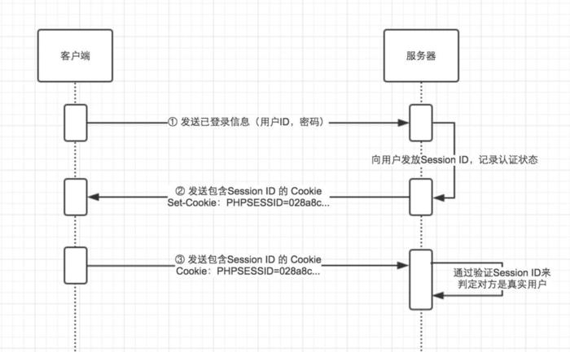

## 什么是JWT

> JSON Web Token (JWT) is a compact, URL-safe means of representing claims to be transferred between two parties. The claims in a JWT are encoded as a JSON object that is used as the payload of a JSON Web Signature (JWS) structure or as the plaintext of a JSON Web Encryption (JWE) structure, enabling the claims to be digitally signed or integrity protected with a Message Authentication Code (MAC) and/or encrypted.
>
> 引自：[JSON Web Token (JWT)](https://tools.ietf.org/html/rfc7519)

简而言之，JWT就是一个加密的字符串，作为验证信息在计算机之间传递，只有可以访问加密密钥的计算机才能对其进行解密，从而验证携带这个令牌（`Token`）的请求是否合法。

<!-- more -->

### JWT 组成

它由三个部分组成：`header.payload.signature`。

#### 1. header

`header` 包含了两个部分 `typ` 和 `alg`，分别是声明类型和JWT的加密算法。

```json
{
  "typ": "JWT",
  "alg": "HS256"
}
```

经过 `base64` 加密之后得到 JWT 的第一部分信息：

```
eyJ0eXAiOiJKV1QiLCJhbGciOiJIUzI1NiJ9
```

#### 2. payload

`payload`：负载，存放有效信息的地方。这些有效信息包含三个部分：标准中注册的声明、公共的声明 和 私有的声明。

> payload 所包含的详细内容见[文章底部](http://huanqiang.wang/2017/12/28/JWT-%E4%BB%8B%E7%BB%8D/#jump)

```json
{ 
  "iss": "Online JWT Builder", 
  "iat": 1416797419, 
  "exp": 1448333419, 
  "aud": "www.gusibi.com", 
  "sub": "uid", 
  "nickname": "goodspeed", 
  "username": "goodspeed", 
  "scopes": [ "admin", "user" ] 
}
```

经过 `base64` 加密之后得到 JWT 的第二部分信息：

```
eyJpc3MiOiJPbmxpbmUgSldUIEJ1aWxkZXIiLCJpYXQiOjE0MTY3OTc0MTksImV4cCI6MTQ0ODMzMzQxOSwiYXVkIjoid3d3Lmd1c2liaS5jb20iLCJzdWIiOiIwMTIzNDU2Nzg5Iiwibmlja25hbWUiOiJnb29kc3BlZWQiLCJ1c2VybmFtZSI6Imdvb2RzcGVlZCIsInNjb3BlcyI6WyJhZG1pbiIsInVzZXIiXX0
```

#### 3. signature

这一部分是一个签名信息，有三个部分组成：`header`、`payload` 和 `secret`。其中 `header` 和 `payload` 都是加密后的字符串，`secret`就是一个字符串（密钥）。

举个例子：当我们的 `secret` 为 `app_secret` 时，就可以应用加密算法得到第三部分内容。

加密算法：

```javascript
var encodedString = base64UrlEncode(header) + '.' + base64UrlEncode(payload);

// 这里的 HMACSHA256() 就是我们在第一部分定义的加密算法。
var signature = HMACSHA256(encodedString, 'secret'); 
```

结果：

```
TJVA95OrM7E2cBab30RMHrHDcEfxjoYZgeFONFh7HgQ
```

最后，我们将这三个部分用 `.` 连接成一个完成的字符串就得到了最终的 JWT：

```
eyJ0eXAiOiJKV1QiLCJhbGciOiJIUzI1NiJ9. eyJpc3MiOiJPbmxpbmUgSldUIEJ1aWxkZXIiLCJpYXQiOjE0MTY3OTc0MTksImV4cCI6MTQ0ODMzMzQxOSwiYXVkIjoid3d3Lmd1c2liaS5jb20iLCJzdWIiOiIwMTIzNDU2Nzg5Iiwibmlja25hbWUiOiJnb29kc3BlZWQiLCJ1c2VybmFtZSI6Imdvb2RzcGVlZCIsInNjb3BlcyI6WyJhZG1pbiIsInVzZXIiXX0.TJVA95OrM7E2cBab30RMHrHDcEfxjoYZgeFONFh7HgQ
```

## 工作方式

举一个例子🌰就能够明白 JWT 在实际项目的使用方式了。

在任意系统中，用户首先都会要要登陆他的账户，他们会向服务发送账号密码，服务器验证通过之后，就会将一个有效负载（`payload`）和一个密钥创建成一个令牌（`Token`），并返回给客户端，客户端保存这个令牌。以后客户端发出的所有请求都会携带这个令牌（客户端会将这个令牌放在请求头的 `x-access-token` 中）。

> 这里服务器创建的令牌就是上文所说的加密的字符串了。

## 为什么使用

在看为什么使用之前，我们必须要先了解，之前我们是如何进行验证请求的。

### Session 认证

在 `Session 认证`方式中，服务器在验证了用户发送过的账号密码请求之后，就会把这个用户信息放入 Session 中，然后把 Session 存在服务器上，这样服务器就知道了这个用户的存在，当下一次用户访问的时候，就能认证了。

但是这样有一个致命的问题： **HTTP 协议是无状态的**，也就是说当下一次用户发送请求的时候，请求中没有任何信息能表明用户身份！也就是说不知道请求是谁发出来了，这样也就不能认证了。

所以有人就提出了 利用 Cookie 来管理 Session，即把 Session 放入 HTTP 响应中还给客户端，并保存在客户端，当客户端发送下一次请求的时候，就把这个 Session 一起发送回来，这样就能这次的请求是谁发出来的了。

> Cookie 是由客户端（通常是浏览器）保存的小型文本信息，其内容是一系列的键值对，是由 HTTP 服务器设置并保存在浏览器上的信息。



[Session 认证流程示意图](http://huanqiang.wang/img/JWT/Session.jpg)

### Session 认证的问题

#### 1. 内存开销大

我们知道 Session 是存在服务器上的，实际上为了加快认证的速度，我们一般都会放在内存中，这样当用户基数大的时候，内存的开销就会很大。当然也可以将 Session 存入到 Session 表或者是缓存（redis等）中，但是依旧会有这样的问题。

#### 2. 安全性（CSRF）

因为是基于 Cookie 进行用户识别，如果 Cookie 被截获，用户就会很容易收到**跨站请求伪造**的攻击。

#### 3. 分布式

因为 Session 信息是被单个服务器所保存的，所以在分布式系统中就不能适用了。比如 Session 一开始是保存在 A 服务器上，但是下一次请求的时候，这个请求被服务器负载均衡转发到了 B 服务器，而 B 服务器则没有这个 Session 信息，所以就不能用过认证了。

> 当然，现在这个分布式下的 Session 管理问题，也有很多的解决方案，这里不就再展开了。

### JWT 的优点

> 当然还有其他认证方案，这里就不再展开。

经过上文的介绍，我们知道 JWT 是服务器生成的，通过请求传给客户端（客户端可以以任意方式存放）。所以服务器不需要存储任何 JWT 信息。这样就能避免了上述 Session 的几个问题了。

- 轻量级：JWT是非常轻量级的，传输的方式多样化，可以通过`URL`/`POST参数`/`HTTP头部`等方式传输。（一般放在 `x-access-token`里）
- 无状态/跨域认证：令牌包含所有用于标识用户的信息，这消除了对会话状态的需要。 如果我们使用负载平衡器，我们可以将用户传递给任何服务器，而不是绑定到我们登录的同一台服务器上。
- 可重用性/扩展性：我们可以有许多独立的服务器在多个平台和域上运行，并重复使用相同的令牌来验证用户。 构建与另一个应用程序共享权限的应用程序很容易。
- 安全性：无需担心跨站请求伪造（CSRF）攻击。

## 问题及解决方案

### 重放攻击（`Replay Attacks`）

又称重播攻击、回放攻击或新鲜性攻击（`Freshness Attacks`），是指攻击者发送一个目的主机已接收过的包，特别是在认证的过程中，用于认证用户身份所接收的包，来达到欺骗系统的目的，主要用于身份认证过程，破坏认证的安全性。

#### 解决方案

建议每个一段时间就更新 `Token`，即对 JWT 设置一个有效时间，并返回一个新的 `Token` 给客户端，客户端再更新 `Token`。对于旧的 `Token`，服务器将其加入黑名单。

## Payload 详细信息

### 1. 标准中注册的声明

- iss：JWT 的签发者
- sub：JWT 所面向的用户
- aud：接收 JWT 的一方
- exp：JWT 的过期时间这个过期时间必须大于签发时间
- nbf：JWT 起作用的开始时间，即定义在什么时间之前，该JWT都是不可用的
- iat：JWT 的签发时间
- jti：JWT 的唯一身份标识，主要用来作为一次性 token，从而回避重放攻击。

### 2. 公共声明

公共声明里可以添加任何内容，一般添加用户相关或其他业务需要的必要信息。不建议添加敏感信息，因为该部分在客户端可解密。

### 3. 私有声明

私有声明是提供者和消费者所共同定义的声明，一般不建议存放敏感信息，因为base64是对称解密的，意味着该部分信息可以归类为明文信息。

## 资料

1. [Securing Node.js RESTful APIs with JSON Web Tokens](https://medium.freecodecamp.org/securing-node-js-restful-apis-with-json-web-tokens-9f811a92bb52)
2. [什么是 JWT – JSON WEB TOKEN](https://www.jianshu.com/p/576dbf44b2ae)
3. [Cookie/Session的机制与安全](http://harttle.land/2015/08/10/cookie-session.html)：不错，可以一下看
4. [Session原理](https://www.jianshu.com/p/2b7c10291aad)
5. [细说分布式Session管理](https://www.jianshu.com/p/3dd4e06bdfa4)：介绍了分布式系统中，Session 的管理问题。