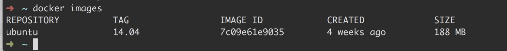

## 使用镜像

### 获取镜像

```bash
docker pull [选项] [Docker Registry地址]<仓库名>:<标签>
```

1. Docker Registry地址：地址格式一般是 <域名/IP>[:端口号]。默认地址一般是 Docker Hub
2. 仓库名：一般是两段式：`<用户名>/<软件名>`，对于 Docker Hub，如果不给出用户名，则默认为 `library`，即官方镜像。

> 详细信息参见 `docker pull --help`。

<!-- more -->

### 列出镜像

```bash
docker images [参数]
```



[docker images](http://huanqiang.wang/img/Docker_Order/docker_images.png)

该列表包含了仓库名、标签、镜像ID、创建时间以及所占用的空间。

在这里，我们可能要注意两个问题：
第一个是这里所展示的所占用的空间和 `Docker Hub` 上所看的镜像大小不一样。这是因为 `Docker Hub` 上为了在网络传输中节约流量，所以进行了压缩，上面显示的也是压缩后的大小。而本地显示的是**镜像展开后各层所占空间的总和**。
第二个就是 `docker images` 列表中展示的各镜像的**总体积**也并非这些所有镜像在硬盘上的实际消耗。这是因为 Docker 镜像是**多层存储结构的，并且可以被继承、复用**，所以不同的镜像可能因为使用了相同的基础镜像而拥有了共同的层，根据 `Union FS` 的机制，**相同的层只会保留一份**，所以实际消耗的空间会小一些。

```bash
# 列出所有的镜像（包括中间层镜像）
docker images -a 

# 列出部分镜像，示例列出的是所有 ubuntu 的镜像
docker images ubuntu 

# 过滤，示例列出了所有在 mongo:3.2 之后建立的镜像
docker images -f since=mongo:3.2

# 以特定格式列出镜像（Go 的模板语法），示例只包含了镜像ID和仓库名
docker images --format "{{.ID}}: {{.Repository}}"
```

### 运行镜像

在这里有一个概念要区分：即 镜像和容器的区别。

镜像和容器的关系有点像 `类与对象` 之间的关系。镜像就像类，是一个静态的定义，容器就像对象，是镜像运行时的实体。容器是**以镜像为基础层**，在其基础上加了一层作为容器运行时的**存储层**。

#### docker run

```bash
docker run -it --rm ubuntu:14.04 bash
```

1. `-t`：这其实是两个参数，一个是 `-i`：交互式操作，即让容器的标准输入保持打开；一个是 `-t`：为 Docker 分配一个伪终端（pseudo-tty）并绑定到容器的标准输入上。
2. `-rm`：这个表明在退出该容器的之后将其删除。默认情况下，退出容器后，容器是不会被删除的，除非你手动 `docker rm` 进行删除。
3. `bash`：放在镜像名后面的是命令，这里的话使我们希望用 `bash` 这个交互式Shell 进行操作。

#### docker exec

docker exec 命令可以进入容器，并修改容器的内容。

```bash
docker exec -it webserver bash
```

在本示例中，我们以交互式终端方式进入一个名为 `webserver` 的容器，并执行了 `bash` 命令，也就是获得一个可操作的 Shell。

#### docker diff

可以看到一个容器的具体改动。

```bash
docker diff <容器名>
```

### 创建/定制镜像

#### docker commit

我们知道容器以镜像为基础层，并在此之上加了一个容器存储层，所以当我们在运行一个容器或者对容器进行操作的时候（在不使用卷的基础上），我们对容器中任何文件的修改都会被记录于容器存储层中。

Docker 提供了一个 `docker commit` 命令，可以把容器存储层上的东西保存下来成为一个镜像。也就是说，我们在原有镜像的基础上，再叠加了一个存储层，构成了一个新的镜像。以后我们在运行这个新镜像的时候，就会拥有原有容器最后的文件变化。

从这里我们就可以看出为何我们之前说镜像是一层一层构建出来的了。正是 Docker 使用的 `Union FS` 技术将这些不同的层结合到一个镜像中来。

```bash
docker commit [选项] <容器ID或容器名> [<仓库名>[:<标签>]]
```

> 最好不要使用 `docker commit` 命令来定制镜像，因为这会存在大量的问题，最好的定制方式是 使用 `Dockerfile` 文件来定制。

#### Dockerfile

Dockerfile 是一个文本文件，它能包含一条条指令，每一条指令都会构建一层。所有在 Dockerfile，尽可能地将操作写在尽可能少的指令（语句）上。

在这里，就不详细介绍 Dockerfile 中的指令的写法及其作用。参见其他文章。

##### 构建镜像

在我们写完 Dockerfile 之后，我们就可以构建这个镜像了。

```bash
docker build [选项] < 上下文路径/ URL / - >
```

举个栗子：

```bash
$ docker build -t nginx:v3 .
Sending build context to Docker daemon 2.048 kB
Step 1 : FROM nginx
---> e43d811ce2f4
Step 2 : RUN echo '<h1>Hello, Docker!</h1>' > /usr/share/nginx/h
tml/index.html
---> Running in 9cdc27646c7b
---> 44aa4490ce2c
Removing intermediate container 9cdc27646c7b
Successfully built 44aa4490ce2c
```

在这个命令里，我们可以清楚的看到镜像被构建的每一步的过程。

### 删除镜像

```bash
docker rmi [选项] <镜像1> [<镜像2> ...]
```

1. `<镜像>` 可以是 `镜像短 ID`、`镜像长 ID`、`镜像名` 或者 `镜像摘要`。

> 注意：删除容器的命令是 `docker rm`，不要弄混了。

## 操作容器

### 运行容器

```bash
docker run 
```

当运行 `docker run` 的时候， Docker 其实进行了以下操作：

1. 检查本地是否存在指定的镜像，不存在就从公有仓库下载；
2. 利用镜像创建并启动一个容器；
3. 分配一个文件系统，并在只读的（基础）镜像层外面挂一层可读写层；
4. 从宿主主机配置的网桥接口中**桥接一个虚拟接口**到容器中去；
5. 从地址池配置一个IP地址给容器；
6. 执行用户指定的应用程序；
7. 执行完毕后容器被终止；

> 以上内容非常重要，非常重要，是 Docker 容器运行的操作；

### 启动已终止的容器

```bash
docker start [容器名/容器ID]
```

该命令可以直接把一个已经终止的容器重新运行。

我们知道**容器的核心是其所执行的应用程序，所需要的资源都是应用程序运行所必需的，除此之外，并没有其他资源。**这种特点也使得 Docker 对资源的利用率极高。

### 终止容器

```bash
docker stop
```

### 查看容器

```bash
docker ps
```

该命令可以看到所有正在运行的容器及其详细信息（包括后台运行）。


[docker ps](http://huanqiang.wang/img/Docker_Order/docker_ps.png)

```bash
docker ps -a
```

当加上 `-a` 参数的时候，就能看到所有的容器，包括已经终止的容器。

### 后台运行

```bash
docker run -d
```

使用了 `-d` 参数后，会返回一个唯一的 `id`，同时容器会进入后台运行，并不会吧输出的结果打印到宿主机上面来。

> 但是我们仍可以使用 `docker logs [容器名/容器ID]` 查看到其输出结果。

虽然容器进入了后台运行，但是我们也可以使用 `docker ps` 查看到所有的容器及其信息。 

### 进入容器

有些时候，虽然容器进入了后台运行，但是，我们仍然需要进行操作。这种情况下，我们就需要借助 `docker attach` 命令和 `nsenter` 工具。

#### attach 命令

```bash
docker attach [容器名]
```

> 容器名可以由 `docker ps` 查看到。

但是 `attach` 也存在一些问题，当多个窗口同时 `attach` 同一个容器的时候，所有的窗口都会同步显示该容器的内容。当其中某个窗口因为某个命令而阻塞时，其他窗口也无法对这个容器进行操作了。

#### nsenter 命令

…

### 导出和导入容器

```bash
docker export [容器ID] > path/name.tar
```

`docker export` 可以将一个容器导出为一个 tar 文件(这是一个容器的快照)。

```bash
docker import [path/url/-] name
```

`docker import` 可以将一个容器快照文件再倒回为**镜像**（即倒回至本地镜像库）。

```bash
docker load
```

`docker load` 能将一个镜像存储文件倒入一个容器快照到本地镜像库。

值得注意的是，容器镜像文件将会丢失所有的历史记录和元数据信息，而镜像存储文件不会丢失数据。

### 删除容器

```bash
docker rm [容器名/容器ID]
```

`dcoker rm` 默认不会删除正在运行的容器，使用当我们想要删除一个运行中的容器的时候，可以添加 `-f` 参数。

```
docker rm $(docker ps -a -q)
```

当我们想要一次性删除所有已经创建且处于终止状态的容器时，可以使用这个命令。