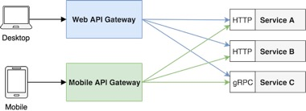
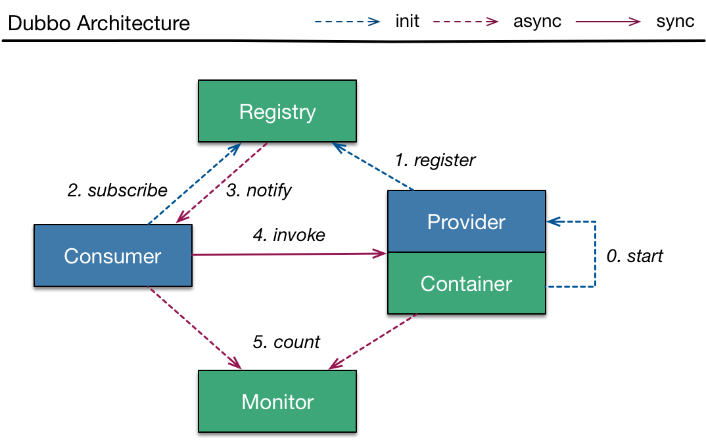

> In short, the microservice architectural style [1] is an approach to developing a single application as a suite of small services, each running in its own process and communicating with lightweight mechanisms, often an HTTP resource API. These services are built around business capabilities and independently deployable by fully automated deployment machinery. There is a bare minimum of centralized management of these services, which may be written in different programming languages and use different data storage technologies.
>
> 引用自 `James Lewis` 和 `Martin Fowler` 的《Microservices》[1]

微服务架构是一种软件架构风格，它是由一组小型的服务组合成一个大的应用系统。每一个服务即微服务，它们运行于自己的进程中，服务之间通过轻量级应用程序进行通信。这些服务围绕业务功能进行构建，通过全自动的部署机制进行独立部署。同时，这些服务还可以使用不同的语言编写，可以使用不同的存储技术进行数据存储，并且保持最低限度的集中式管理。

<!-- more -->

## 一、架构的演变

### 单体式应用（ `Monolith` ）

正如我们日常编写的项目，在一个需求来了之后，我们经过了详细的需求讨论（甚至没有），然后打开了编译器，创建了一个新的项目，上传至 GitHub 或者其他版本管理工具中，供其他开发人员一同开发。你们可能采用了六边形架构模块设计，也可能没有进行模块的区分。就是一个单体式的应用。

单体式应用非常的普遍，因为它符合人们最熟悉的开发流程，从我们一开始接触编程，开发第一个项目开始，就是这样子的一个流程。而且我们的编译器和其他编程工具也都非常擅长构建单体式应用。不仅如此，单体式应用还易于测试（包括端到端测试 和 UI测试等），同时也非常易于部署发布。

单体式应用非常的简便，但这也就是它致命的缺陷。随着项目业务的不断增加，复杂度越来越高，项目中的代码也越来越不可控，这对于开发人员来说简直就是噩梦。

1. **代码量过多，结构过于复杂**：一旦应用变得庞大，代码就会不可避免地会变得更加复杂。那么开发人员将越来越难去理解之前写的业务代码，那么修复 bug 和实施新功能也就极其困难且耗时颇多。
2. **可靠性低下**：由于所有模块都运行在同一进程中，任何模块中的一个 bug，比如内存泄漏都可能弄垮整个进程；此外，由于应用中的所有实例都是唯一，这个 bug 将影响整个应用的可用性。
3. **技术更新困难**：因为一个单体式应用的技术选型在一开始搭建项目的时候就已经定下来了，这个时候如果你想引入新的框架、新的技术或是新的编程语言，无论是时间还是成本都将非常昂贵。
4. **启动时间过长**：我们知道代码量越多，应用的启动时间就会随之变长。当应用程序规模超大的，启动时间成了巨大的问题。据说有的应用的启动时间长达40分钟 [4]。
5. **难以进行持续部署**：现在， SaaS 应用的发展水平足以在单日内多次将修改推送到生产环境。然而要让复杂的单个应用达到此水平却极为棘手。想更新应用的单个部分，必须重新部署整个应用，漫长的启动时间更是雪上加霜。另外，由于不能完全预见修改的影响，你不得不提前进行大量人工测试。结果就是，持续部署变得不可能。
6. **扩展变得艰难**

对于软件开发来说，技术发展的目标是提高软件开发效率或者延长软件生命周期等。随着企业的发展，越来越多企业意识到对企业级应用改造的必要性。实现软件应用的改造需要考虑三个方面：重用、标准化封装和松散耦合，基于这一概念，面向服务计算随即产生，它作为一种新的计算范式，主要思想是将服务作为基本构建单元，通过服务间的重用和组装实现应用系统间的松散耦合。

### SOA（面向服务的体系结构）

SOA是一种架构的设计方法，是包含运行环境、编程模型、架构风格和相关方法论等在内的一整套新的分布式软件系统构造方法和环境，涵盖服务的整个生命周期：建模-开发-整合-部署-运行-管理 [4]。

在SOA架构风格中，服务是最核心的抽象手段，业务被划分（组件化）为一系列粗粒度的业务服务和业务流程。业务服务相对独立、自包含、可重用，由一个或者多个分布的系统所实现，而业务流程由服务组装而来。

SOA 并不代表一个特定的技术或者是特定的方案，它只是为设计人员提供指导。而现在最为人所知的 SOA 架构的风格的则是 ESB（即企业服务总线）。

> ESB 是一种集中式的治理模式。

私以为**微服务是 SOA 的一种特定方法**，这一点在《building mircoservice》[3] 和 `Martin Fowler` 的《Microservices》[1]中都有表述。

## 二、什么是微服务架构

随着操作系统虚拟化、**容器化**、**DevOps**以及NoSQL等技术的兴起，微服务架构应运而生。诸如亚马逊、eBay、Netflix 等公司已经通过采用微服务架构范式解决了上文提到的问题。不同于构建单一、庞大的应用，微服务架构将应用拆分为一套小且互相关联的服务。

### 微服务的特性

> 本部分内容主要来自于James Lewis 和 Martin Fowler 《Microservices》[1]。这里只是进行了概括，详细内容请阅读原文。

#### 1）组件化

**组件是微服务架构中可以独立替换和升级的软件单元**。在《Microservices》中组件有两种：服务（ `Service` ）和 库（ `Library` ）。微服务选用了服务作为一个独立的组件。一个组件即一个独立的微服务。

- 服务（ `Service` ）：是一种通过轻量级通信机制（如 HTTP 请求等）来进行通信的进程外组件。可独立部署，并且接口更明确。
- 库（ `Library` ）：是一种链接到项目里，并通过内存中的函数调用方式进行调用的组件。虽然通信成本低，但是一旦更改了一个库，整个应用就必须要重新部署。

在设计微服务的时候，通常用使用领域驱动设计 [3、9]的方法来设计组件的上下文边界，可以最大化的减少的各个服务之间的业务冗余。同时，为了各个业务之间的数据通信，必须要设计明确的对外组件接口。因为服务之间相互依赖性低，所以服务的是可以独立部署的。

> **那么每个组件可以有多小，小到什么程度才能算微服务？**
>
> 1. 一个服务可以有二三个人组成的团队完全负责（服务的完整的生命周期），即一个披萨原则；
> 2. 一个服务的业务（功能）逻辑、代码逻辑能够很容易地被开发者理解；

#### 2）团队组织

将整个应用分割成了每一个规模不大的、独立的服务。所以可以有一个小的团队的来全权负责这个服务的完全生命周期，包括开发、测试、部署等流程。这个团队是跨职能的，它包含开发这个服务的所有技能：应用体验（ `user-experience` ）、数据存储和项目管理。

> 关于团队的规模，`Amazon`提一个良好的建议：`Two Pizza Team` ，即这个团队的成员的一顿饭的量只需要两个披萨。

**一个小型的团队更有助于一个服务的开发，因为小规模的团队成员之间的沟通成本小，更能专注于业务本身**。而负责一个大规模项目的大型团队呢，他们会将软件系统划分成UI界面、后台服务、数据库等，那么人员也会相应的划分成前端团队，后台团队和DBA团队等。尽管他们还可以按照业务来分割项目（模块化），但是这样依旧会有很多的依赖，这就会导致很多时候必须跨域模块边界去沟通，而且这样的团队中的开发人员各司其职，需要大量的沟通才能完成一些简单地任务。

> Any organization that designs a system (defined broadly) will produce a design whose structure is a copy of the organization’s communication structure. ——Melvyn Conway, 1967

#### 3）以 Product 为核心而非 Project

在完成一个项目的时候，应该以产品为核心，而不是完成组合一个个独立的功能的代码（项目）。**因为产品是为用户服务的，它的目的是如何持续地帮助用户提高其业务能力**。

所以当一个团队全权负责一个项目的时候，这就是要求开发人员必须关注他们负责的产品运行情况，提高产品的可用性，并提供技术支持（无法推脱）。

#### 4）通讯机制

微服务架构中的通信机制是以 **明确的接口** **和 轻量级通信机制** 为基础的。因为现在网络的通常我们会选择 REST 风格的 HTTP 请求（或者 [GraphQL?](http://graphql.org/)）。

#### 5）组件分治

因为各个组件由各个专属团队负责，而且采用通用的HTTP请求来进行通信，所以各组件之间所采用的技术就毫无关系了，可以使用不同的框架、不同的编程语言、甚至不同的存储方式（关系型数据库或者是NOSQL等），只要满足协议规定的接口即可。这就极大的提高了**技术和管理自由度**。

> you build, you run it. — Amazon

#### 6）数据管理分治

对于数据存储的管理，这里推荐的是各个服务管理其自有数据库，即去中心化管理数据。因为我们在使用领域模型驱动分解系统的时候，已经明确的界定了上下文边界，也就将数据模型划分到了各个组件之中。

> [「Chris Richardson 微服务系列」事件驱动的数据管理](http://blog.daocloud.io/microservices-5/)：这里讲述了如何设计微服务中数据管理以及所需要注意的注意点。

#### 7）容错设计

由于微服务的架构服务独立部署、独立运维的特征，各个服务随时出现故障，或者服务间在调用的过程中很容易出现错误或调用失败，导致相应的功能流程出现问题或者数据纰漏。所以容错设计就非常的重要了。

为此我们需要**监控**到微服务架构中的元素和业务先关的指标，比如各种状态和操作的情况、业务相关的指标、当前系统的吞吐量和延迟情况等。

#### 8）基础设施自动化

基础设施自动化技术在过去几年中得到了长足的发展：云计算，特别是AWS的发展，减少了构建、发布、运维微服务的复杂性。

微服务架构中的每一个服务所依赖的基础设施自动化和之前的单体式应用并无不同，只是更加依赖，尤其是更多的自动化测试，以保证各个服务的可靠性。

> 自动化构建流程：编译和单元测试 -> 验收测试 -> 集成测试 -> 用户验收测试 -> 性能测试 -> 部署

#### 9）演进式设计

当决定将一个系统由单体式向微服务演讲的时候，我们切勿操之过急。

1. 首先，当有新的业务功能需要进入的时候，我们可以将其以一个单独的服务添加进来，独立于原有的系统，通过调用原有系统的API进行通信。这样的设计对于临时性的功能尤为有用，比如一个临时的抽奖功能，在需要的时候添加进来，用完了再将这个服务删除即可。
2. 对于原有的单体式应用，我们可以使用领域模型设计将其分解成各个组件。在分解时，应该遵循组件的关键属性：独立替换和升级。

同时对于一个已经基于微服务架构的系统，我们也不是死守着设计好的服务不变，也会随着业务的变化，将其继续分解或和其他服务的业务合并再分解。

### 微服务的优势

微服务的优势在上一节已经表述的很明确了，这里就在总结一些。

1. 服务组件化：每一个服务都是可以独立替换和升级的，**服务的上下文之间根据业务领域进行划分**，服务之间相互隔离。每一个服务专注于一个业务功能，开发者可以根据临时需求随时快速更新单个服务，而不会对系统中的其他功能造成影响。同时也可以加快部署速度，使得持续化集成、部署更加方便。
2. 团队专一化：一个服务由一个团队专门负责，提高了团队对服务的责任度。同时，各个团队也可以自由选择合适的技术来完成业务需求。
3. 可扩展性：因为服务之间是隔离的，微服务架构使得每一个服务的独立扩展变得异常方便。
4. 独立部署：你可以根据每个服务的规模来部署满足需求的实利。甚至于，你可以使用更适合于服务资源需求的硬件。

### 微服务的缺点

软件开发没有银弹，微服务架构也是一样的。正如《微服务：从设计到部署》中提到的，微服务这个术语本身就是有问题的，这个术语侧重于服务的规模（颗粒度），事实上微服务架构本身的目的则是**充分分解应用程序使之方便地应用敏捷开发和部署**。接下来看看微服务的其他缺陷：

1. 服务通信的复杂性：虽然服务间可以通过轻量级 HTTP 协议通信，但是 HTTP 协议通信受限于很容易失败（可能是网络错误），所以一旦失败就会导致这次请求错误，可能会造成系统的数据不统一等问题。我们就必须提供服务监控以发现错误和服务容错机制。
2. 数据库管理的一致性：在微服务架构中，数据库是被分治的，所以**事务就很难保证一致性**，虽然我们就可以使用**操作幂等性**和**重试机制**来尽可能地保证数据不出错，但是你可能有一些情况，你只需要一个事务失败或成功，而不会处于中间状态。解决这个问题或者在微服务模型中实现它的成本是非常高的。
3. 整体测试的复杂性：
4. 多服务的联动变化：比如说 A 服务依赖于 B，B 依赖于 C。那么当你改变了C 的时候，必须要保证 A 、B 服务不会出现问题，
5. 整体部署的复杂性：一个单体式应用是很好部署的。但是一个基于微服务的应用程序的部署却是不容易的。每一个服务都有多个运行时实例，需要为其配置监控，容错。同时，你还需要实现一个服务发现机制，以便服务能发现其他需要通信的服务的位置（地址）。

## 三、如何设计微服务架构

### 领域驱动模型

> 这块太大了，待完善

### 几个关键点设计

在设计微服务架构的时候，最需要注意的几个关键点就是 **API 网关**、**数据存储** 和 **部署策略**。

#### 1. API 网关 与通信机制

在微服务架构中，我们已知后端（前后端分离）的服务根据领域驱动设计分割成了几个隔离的服务，服务之间基于轻量级通信机制来进行数据的交互（通常使用 HTTP 协议）。

那么现在问题来了：微服务的入口在哪里？举个栗子：现在客户端分别需要 A、B 两个服务的两个 API 的数据，那么它是不是就需要分别向 A、B 发送请求，也就是说客户端需要知道每一个服务的地址，每次更新了服务地址，就必须修改客户端中的地址。

很明显上面这样的方案是行不通的，它把客户端和后端的各个服务紧紧地耦合在了一起，所以我们需要将两者解耦。方法也很简单，就在这两者之间插入一个中间件，**负责把客户端发送过来转发给指定的后台服务**，**承担起微服务的入口的功能**，我们称之为 **API 网关**。

[API-Gateway](http://huanqiang.wang/img/MicroService/API-Gateway.png)

当然，API 网关不止**转发请求**这一个功能，它还可以进行负载均衡、转换协议、数据聚合、数据转换、共享逻辑（比如认证、限速等）功能：

1. **负载均衡**：这个就不需要介绍了，很明显的功能。
2. **转换协议**：比如客户端发送给网关的是 RESTful 风格 HTTP请求，而后台服务使用的则是 gRPC 或者 GraphQL。正常情况下，前端是不能直接请求后端的数据，但是现在客户端只要向 API 网关发送请求，然后 API 网关适用后端服务所需要的协议格式再进行请求即可。
3. **数据聚合**：比如客户端需要一个数据，但是这个数据被分成了三个部分分别由三个服务存储，那么我们就可以由API 网关分别发送三个 API 请求，然后将获取回来的数据组合成客户端需要的数据。
4. **数据转换**：比如客户端需要的是 JSON 合适的数据，但是后端返回的是 XML 或者其他格式，这就需要 API 网关将 XML 转换成 JSON 再返回给客户端。
5. **共享逻辑**：**认证与限速**都算 API 网关中的 **共享逻辑** 部分的功能，其实就是 API 网关的非功能性需求吧。

#### 2. 服务发现机制

现在我们有了 API 网关来管理客户端与后端的 API 交互。它解决了微服务的入口问题，但是这就完美了吗？当然没有，让我们仔细回想一下，引入 API 网关的本意是什么，是为了解耦客户端和后端（注1）。现在呢，我们只是将后端服务和客户端的耦合转移到了网关这里而已。因为网关要存储所有需要的后端的地址。

> 注1：之前前端必须要存储所有需要的后端的地址，有了 API 网关之后，客户端现在只需要存储 API 网关的地址，其余的交给了网关处理。

其实上述问题的本质是**如何发现服务**，为了解决这个问题，我们继续引入**服务端发现机制**。具体的做法是：我们引入一个**服务注册表**，**用于管理所有服务及其地址等信息**。那么 API 网关只需要向这个服务注册表中查找服务对应的地址即可。

> 整体的流程如下：客户端并不直接向服务发送请求，客户端向 API 网关发送请求，API 网关服务再从注册服务上获取当前请求的服务URL，再将请求转发至服务。

在服务注册表中，服务的注册和更新方式有两种：1. 服务实例自注册并更新；2. 使用第三方服务注册和更新。

> 自注册案例，可以参考 Netflix Eureka。

#### 3. 数据存储

在微服务架构中，数据存储应当随着服务的上下文边界切割，每一个服务有着自己的数据库。

在传统单体式项目中，一个应用中的各个模块共用一个数据库，它能很好地保证事务一致性。而在微服务架构中，如果共用一个数据库则会有**高耦合度**的问题，比如一个服务想要修改一个表的结构，那么它在修改的时候要极其小心，应该这个表也可能是其他服务正在使用的，在这样的情况下，我们必要做大量的测试才能保证修改后各个功能是正确的。

所以我们应该让每一个服务管理相应的数据库，这样能够提高可维护性和可扩展性，还能提高数据库的技术自由度（比如有些使用关系型数据库，有些根据需要可以使用非关系性数据库）。

在分解数据库的时候，我们仍需要注意很多东西：**数据库的事务一致性**、外键关系怎么处理、静态数据怎么处理、共享数据怎么处理、共享表怎么处理等等。

> 以下解决方案参考 《Build MicroService》一书的第5张第5.5小节至5.11小节。

1. 外键关系：把这个约束转移至代码中，在需要的时候通过 API 去其他服务请求数据；
2. 静态数据：
   1. 方法1：为每一个服务复制一份该表的内容；
   2. 方法2：将这些共享的静态数据放入静态配置文件或代码之中；（推荐）
   3. 方法3：将这些静态数据放入一个单独的服务，如果数据量和相关的规则复杂就可以使用这个方法；
3. 共享数据：我们可以将共享的部分提取出来，新建一个服务管理这些数据，其他服务访问这个新服务来获取数据；
4. 共享表：把表按照需求拆分；

> [知乎问答 - 微服务的架构模式中，数据库如何规划？如果采用独享数据库，如何解决事务处理和联合查询？](https://www.zhihu.com/question/65075067)：这里的回答也很有参考意义，有分布式事务的最终一致性等等。

## 四、微服务框架

这里对微服务框架就不做具体阐述了，只简单介绍下吧。最主流的微服务架构是 `Dubbo` 和 `SpringCloud`。

### Dubbo

> Dubbo：一个高性能，基于Java的开源RPC框架。（[官网在此](http://dubbo.io/?spm=a2c4e.11153959.blogcont250133.16.11a99e94JbOlIC)）

Dubbo 一个高性能，基于Java的RPC和微服务框架，由阿里巴巴开源。 和许多RPC系统一样，dubbo基于定义一个服务的思想，指定可以通过参数和返回类型远程调用的方法。 在服务器端，服务器实现这个接口并运行一个dubbo服务器来处理客户端调用。 在客户端，客户端有一个存根，提供与服务器相同的方法。

[Dubbo-Architecture](http://huanqiang.wang/img/MicroService/Dubbo-Architecture.png)

Dubbo提供了三个关键功能，包括基于接口的远程调用，容错和负载均衡以及自动服务注册和发现。

Dubbo 提供的组件：

1. Provider – 当暴露一个服务的时候，Provider 会自动注册该服务；
2. Container – 启动、加载、运行服务的地方；
3. Consumer – 能调用远程服务，Consumer 会订阅所需的服务；
4. Registry – 注册和发现服务的地方；
5. Monitor – 记录服务的统计信息，例如，给定时间间隔内服务调用的频率；

### SpringCloud

> SpringCloud：[官网在此](http://projects.spring.io/spring-cloud/)

`SpringCloud` 是一系列框架的集合，它能帮助开发人员快速构建分布式系统。同时，`SpringCloud` 利用 `SpringBoot` 巧妙的简化了项目的基础设施的配置。

> `SpringCloud` 就相当于一个工具包，包括了服务的注册与发现、配置管理、消息总线、负载均衡、断路器、数据监控等功能。

核心组件：

1. `Spring Cloud Netflix` ：各种Netflix OSS组件(`Eureka`, `Hystrix`, `Zuul`, `Archaius`等)集成，组成微服务的核心；

   > 1. **Netflix Eureka**：Eureka 是服务中心，一个基于REST的服务，主要用于定位服务，以实现中间层服务器的负载平衡和故障转移。
   > 2. **Netflix Hystrix**：在分布式环境中，许多服务依赖关系中的一些不可避免地会失败。 Hystrix是一个库，通过添加延迟容差和容错逻辑，帮助您控制这些分布式服务之间的交互。 Hystrix通过隔离服务之间的访问点，阻止它们之间的级联故障以及提供回退选项来实现这一点，所有这些都可以提高系统的整体弹性。
   > 3. **Netflix Zuul**：Zuul 是微服务的入口，一个API网关，能实现动态路由、监控、弹性和安全性
   > 4. **Netflix Archaius**：是一个**配置管理库**，专注于来自多个配置存储库的动态属性。

2. `Spring Cloud Config`：配置中心；

3. `Spring Cloud Bus`：消息、数据总线，用于传播状态的变化；

4. `Spring Cloud Cluster`：提供在分布式系统中的集群所需要的基础功能的支持，如：选举、集群的状态一致性、全局锁、tokens等常见状态模式的抽象和实现。

5. `Spring Cloud Consul`：服务发现和配置管理。

## 五、资料

1. [《Microservices》](http://martinfowler.com/articles/microservices.html)：James Lewis 和 Martin Fowler 关于微服务的著作原文。
2. [“微服务”博客中译完整版](https://mp.weixin.qq.com/s?__biz=MjM5MjEwNTEzOQ==&mid=401500724&idx=1&sn=4e42fa2ffcd5732ae044fe6a387a1cc3#rd)：James Lewis 和 Martin Fowler 的 《microservices》的中译版，必看内容；
3. `《building mircoservice》`
4. [Chris Richardson 的微服务架构网站](http://microservices.io/patterns/cn/index.html)
5. [SOA：原理•方法•实践，第 1 部分: SOA 的基本概念](https://www.ibm.com/developerworks/cn/webservices/0708_xinsheng/index1.html)
6. [纯洁的微笑 - Spring Cloud系列文章](http://www.ityouknow.com/spring-cloud.html)
7. [阿里云栖 -【技术干货】Docker精华学习资料集锦，老司机快上车](https://zhuanlan.zhihu.com/p/26221467)
8. [阿里云栖 - Docker学习路线图（配基于阿里云容器服务实践教程）](https://zhuanlan.zhihu.com/p/26221700)
9. 《领域驱动设计》
10. [《分布式事务？No, 最终一致性》](https://zhuanlan.zhihu.com/p/25933039?utm_source=tuicool&utm_medium=referral)