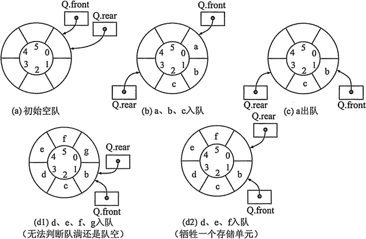
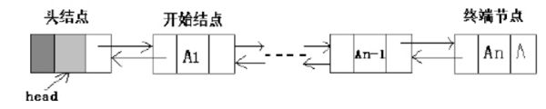
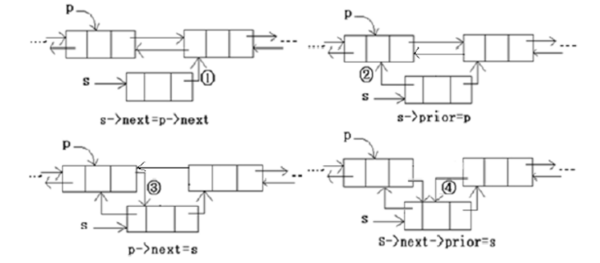
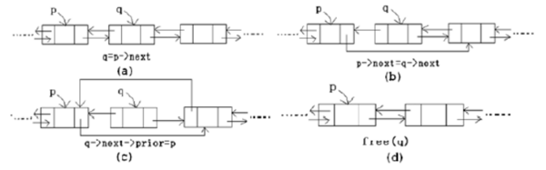

# 栈和队列

## 简介

栈与队列都是动态集合，且在其上进行 Delete操作所移除的元素都是预先设定的。

在栈中，被删除的元素是最近插入的元素，它所实现的是后进先出策略（last-in, first-out, LIFO）；

在队列中，被删除元素总是在集合中存在时间最长的那个元素，也就是说它所实现的是先进先出策略（first-in, first-out, FIFO）;

<!-- more -->

## 操作

### 栈

栈的操作都比较简单，无非进栈出栈，这里就不展开了，用代码简单表示一下。

```c
// MARK: - 栈

#define NKeys 100
#define YES 1
#define NO 0

// 利用一个结构体，做一个简单的栈的示例
struct Stack {
    int list[NKeys];
    int top;
};

// 判断一个栈是否为空
int stack_isEmpty(struct Stack *s) {
    if (s->top == 0) {
        return YES;
    }else {
        return NO;
    }
}

// 初始化一个栈
void stack_init(struct Stack *s) {
    s->top = 0;
}

// Push: 入栈操作
void stack_push(struct Stack *s, int x) {
    s->list[s->top++] = x;
}

// Pop: 出栈操作

int stack_pop(struct Stack *s) {
    if (stack_isEmpty(s) == YES) {
        return 0;
    }else {
        return s->list[--s->top];
    }
}
```

### 队列

相对于栈，队列可实现的操作要复杂的多，队列可分成`顺序队列`、`循环队列`和`双端队列`等，这里就不展开了，只介绍下稍稍复杂的`循环队列`的操作。

> 1. 循环队列：将向量空间想象为一个首尾相接的圆环，并称这种向量为循环向量。存储在其中的队列称为循环队列（Circular Queue）。
> 2. 双端队列：顺序队列的插入和删除操作只能分别在两端进行，而双端队列的插入和删除操作则在两端都可以。

关于循环队列的出入队列示意图:



[循环队列的空和满的状态判断](http://huanqiang.wang/img/DataStructure/queue.jpg)

显然，队空的条件是 Q.front == Q.rear。 如果入队元素的速度快于出队元素的速度，队尾指针很快就赶上了队首指针，如图3-7(d1)，此时可以看出队满时也有 Q.front == Q.rear。所以我们可以得出以下结论：

1. 队满条件为：(Q.rear + 1) % MaxSize == Q.front。
2. 队空条件仍为：Q.front == Q.rear。

```c
// 循环队列

#define qlength 10

struct Queue {
    int list[qlength];
    int head;        // 头
    int tail;        // 尾
};


// 初始化一个队列
void queue_init(struct Queue *q) {
    q->head = 0;
    q->tail = 0;
}

// 判断一个队列是不是空的
int queue_isEmpty(struct Queue *q) {
    if (q->head == q->tail) {
        return YES;
    }else {
        return NO;
    }
}

// 判断一个队列是不是满的，如果是普通队列，用 q->tail == qlength 即可
int queue_isFull(struct Queue *q) {
    if (q->head == (q->tail + 1) % qlength) {
        return YES;
    }else {
        return NO;
    }
}

// enQueue：入队列操作
void queue_insertion(struct Queue *q, int x) {
    if (queue_isFull(q) == NO) {
        q->list[q->tail] = x;
        q->tail = (q->tail + 1) % qlength;
    }
}

// deQueue：出队列操作
int queue_delete(struct Queue *q) {
    if (queue_isEmpty(q) == NO) {
        int temp = q->list[q->head];
        q->head = (q->head + 1) % qlength;
        return temp;
    }else {
        return 0;
    }
}


int main(int argc, const char * argv[]) {
    // insert code here...
    
    struct Queue queue;
    struct Queue *q = &queue;
    int list[6] = {4, 5, 2, 8, 9, 1};
    
    queue_init(q);
    
    for (int i = 0; i < 6; i++) {
        queue_insertion(q, list[i]);
    }
    
    int temp;
    while ((temp = queue_delete(q)) != 0) {
        printf("%d ", temp);
    }    
    
    return 0;
}
```

# 链表

## 简介

链表是一种数据结构，其中的各对象按线性顺序排列。我们都知道数组的线性顺序呢是由数组下标决定的，而链表呢，他则是由各个对象里面的指针决定的。

链表有很多种形式，如单链表，双链表，已排序和未排序的，循环和非循环的等等。

1. **普通单向链表**：只能每次从前往后走；
2. **双向链表**：则方便得多，它包含两个指针：next和prev，一个指向前一个结点，一个指向后一个结点，所以它既能向前走，也能向后走。
3. **循环链表**：表头结点的prev指向表尾结点，同样的，表尾结点的next指向表头结点。

## 核心操作

链表的操作也无非是插入、删除等。这里我们以稍稍复杂的双向链表为例，同时我们的头结点是空结点。

> 图片来自网页，表明一个意思就好，具体的请结合下面的代码



[双向链表示例](http://huanqiang.wang/img/DataStructure/Two_way_Linked_List.png)



[双向链表示例](http://huanqiang.wang/img/DataStructure/Two_way_Linked_List_Insert.png)



[双向链表示例](http://huanqiang.wang/img/DataStructure/Two_way_Linked_List_Delete.png)

### 核心代码

```C
// 链表
#include <stdlib.h>

struct LNode {
    int key;
    struct LNode *prev;
    struct LNode *next;
};

// 分配一个 LNode 的内存
struct LNode *lNode_alloc() {
    struct LNode *head = (struct LNode *)malloc(sizeof(struct LNode));
    head->next = NULL;
    head->prev = NULL;
    
    return head;
}

// 判断一个链表是否为空
int lNode_isEmpty(struct LNode *head) {
    if (head->next != NULL) {
        return NO;
    }else {
        return YES;
    }
}

// 计算链表长度
int lNode_length(struct LNode *head) {
    int length = 0;
    struct LNode *h = head;
    
    while (h->next != NULL) {
        length++;
        h = h->next;
    }
    
    return length;
}

// 在链表中插入一个结点
// 插入节点有很多种，比如在头部插入，在尾部插入，在指定位置插入，如果该链表是一组已经排序好了的，则可以按值顺序插入
// 这里我们使用尾部插入
void lNode_insert_tail(struct LNode *head, int x) {
    struct LNode *h = head;
    
    while (h->next != NULL) {
        h = h->next;
    }
    
    struct LNode *newNode = lNode_alloc();
    newNode->key = x;
    
    newNode->prev = h;
    h->next = newNode;
}

// 在指定位置插入
int lNode_insert_index(struct LNode *head, int x, int index) {
    if (index > lNode_length(head)) {
        return 0;
    }
    struct LNode *h = head;
    
    // 在做完这个循环的时候，我们已经找到了这个index位置的那个节点
    // 所以，我们只需要在这个节点之前插入数据即可
    while (index--) {
        h = h->next;
    }
    
    // 创建新的节点
    struct LNode *newNode = lNode_alloc();
    newNode->key = x;
    
    // 将新的节点在我们找到的节点之前插入
    h->prev->next = newNode;
    newNode->next = h;
    
    return 1;
}

// 从链表中删除一个结点
// 删除结点有很多种，比如从删除最后一个元素，删除指定位置的元素，删除指定值的元素等等
// 这里我们演示一个删除指定位置的元素
int lNode_delete(struct LNode *head, int index) {
    if (index > lNode_length(head)) {
        return 0;
    }
    
    struct LNode *h = head;
    
    while (index--) {
        h = h->next;
    }
    
    int temp = h->key;
    h->prev->next = h->next;
    h->next->prev = h->prev;
    
    return temp;
}

// 输出
void lNode_display(struct LNode *head) {
    struct LNode *h = head->next;

    while (h != NULL) {
        printf("%d ", h->key);
        h = h->next;
    }
    printf("\n");
}
```