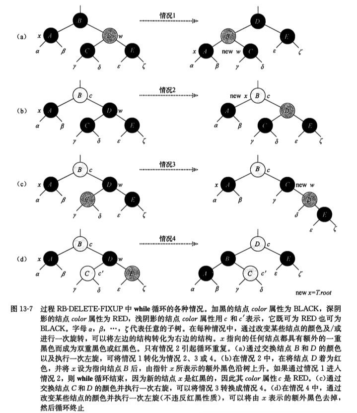

红黑树，实质上一棵二叉排序树（二叉搜索树），只不过它基于二叉排序树的基础上，在每个结点上新增了一个存储位来表示结点的颜色（红色或者黑色），同时通过对任何一条从跟到叶子的简单路径上各个结点的颜色进行约束。

<!-- more -->

## 性质

### 基本性质

一个红黑树必须要满足下面5个性质：

1. 每一个结点的颜色不是红色就是黑色；
2. 根结点一定是黑色的；
3. 每个叶结点（tree->nilNode）一定是黑色的；
4. 如果一个结点是红色的，则它的两个子结点一定都是黑色的；
5. 对于每个结点，从该结点到其所有的后代叶结点的简单路径上，均包含相同数据的黑色结点；

[](http://huanqiang.wang/img/RedBlackTree/RedBlackTree_Simple.png)

[红黑树示意图](http://huanqiang.wang/img/RedBlackTree/RedBlackTree_Simple.png)

### 其他属性

#### 黑高

黑高是指从某个结点x出发（不含该结点）到达任意一个叶子结点的任意一条路径上的黑色结点个数。

一棵红黑树的黑高就是其根结点的黑高，因为根据性质5，我们知道从根到任意叶子结点的简单路径上的黑色结点的个数相同。

## 用途

红黑树是复杂的，但是它的操作有着良好的最坏情况运行时间，而且十分高效：它可以在 O(lgn) 时间内完成查找、插入和删除操作。

在**计算几何**中使用的很多**数据结构**都可以基于红黑树。而且红黑树在**函数式编程**中也特别有用，在这里，它是最常用的**持久数据结构（persistent data structure）**之一，用来构造关联数组和集合，每次插入、删除之后它能保持为以前的版本。除了 O(lgn) 的时间之外，红黑树的持久版本对每次插入或删除需要 O(lgn) 的空间。

## 操作

我们先给出本文所使用的红黑树的简单的数据结构：

```c
// 约定颜色
#define Red 1
#define Black 0

// 红黑树的一个结点
typedef struct rb_TNode {
    int key;
    int color;             // color
    struct rb_TNode *left;
    struct rb_TNode *right;
    struct rb_TNode *parent;  // 记录父结点
}TNode;

// 一颗红黑树
typedef struct rb_Tree {
    TNode *root;
    TNode *nilNode;  // 作为哨兵的空结点，本文中所有的空结点均指向它。
}Tree;
```

同时，我们为了方便处理红黑树中的边界问题，我们使用一个哨兵对象来代表 NIL（空）。我们将该哨兵对象存于tree中，并且将其设成与树中其他子结点数据结构相同的对象，**它的Color属性为Black**，其他属性任意。我们将代码中所有指向 NIl（空）的指针全部指向该哨兵对象。

[](http://huanqiang.wang/img/RedBlackTree/RedBlackTree_OneNil.png)

[红黑树示意图](http://huanqiang.wang/img/RedBlackTree/RedBlackTree_OneNil.png)

### 旋转

当我们对红黑树进行进行 insert 或者 delete 操作的时候，可能会使得操作后的树违背红黑树的基本性质。所以，为了维护这些性质，我们必须改变树中的某些结点的**颜色**及其**指针结构**。而其中的**指针结构**则需要通过**旋转**来完成。

旋转包括左旋和右旋。

1. 当我们需要对 结点x 做左旋的时候，首先我们要保证它的右孩子y不是空结点（nilNode），然后它会使 y 成为该子树的新的根结点，x 则成为 y 的左孩子，y的左孩子成为 x 的右孩子。
2. 同理，当我们需要对 结点x 做右旋的时候，首先我们要保证它的左孩子y不是空结点（nilNode），然后它会使 y 成为该子树的新的根结点，x 则成为 y 的右孩子，y的右孩子成为 x 的左孩子。

[](http://huanqiang.wang/img/RedBlackTree/RedBlackTree_Ratation.png)

[旋转示意图](http://huanqiang.wang/img/RedBlackTree/RedBlackTree_Ratation.png)

```c
//一、左旋代码分析
/*-----------------------------------------------------------
 |   node           right
 |   /  \    ==>    /   \
 |  a  right      node   y
 |      /  \      /  \
 |     b    y    a    b        //左旋
 -----------------------------------------------------------*/
TNode * tree_left_rotation(Tree *tree, TNode *node) {
    // 找到和 node 进行左旋的那个子结点：即右结点
    TNode *rightNode = node->right;
    
    // 将 rightNode 的左结点 变成 node 的右结点
    node->right = rightNode->left;
    
    // 判断 rightNode结点 的左结点是否为空
    // 如果为空，就无需将给 rightNode结点的左结点 赋上父结点的；
    // 如果不为空的话，就将 node结点 给 rightNode结点的左结点作为其父结点。
    if (rightNode->left != tree->nilNode) {
        rightNode->left->parent = node;
    }
    
    // 将 node 的父结点 变成 rightNode 的父结点
    rightNode->parent = node->parent;
    
    // 判断 node 是不是根结点
    if (node->parent == tree->nilNode) {
        tree->root = rightNode;
        
    // 如果node不是根结点，就判断 node 是其父结点的左孩子还是右孩子
    }else if (node == node->parent->left) {
        node->parent->left = rightNode;
    }else {
        node->parent->right = rightNode;
    }
    
    // 将 node 作为 rightNode 的左结点
    rightNode->left = node;
    
    // 将 rightNode 变成 node 的父结点
    node->parent = rightNode;
    
    return tree->root;
}


// 右旋：代码基本同上，只是一些基础的转变结点不同；
TNode * tree_right_rotation(TNode *root, TNode *node, TNode *nilNode) {
    // 找到和 node 进行右旋的那个子结点：即左结点
    TNode *leftNode = node->left;
    node->left = leftNode->right;
    
    if (leftNode->right != nilNode) {
        leftNode->right->parent = leftNode;
    }
    
    leftNode->parent = node->parent;
    
    if (node->parent == nilNode) {
        root = leftNode;
    }else if (node == node->parent->left) {
        node->parent->left = leftNode;
    }else {
        node->parent->right = leftNode;
    }

    leftNode->right = node;
    node->parent = leftNode;
    
    return root;
}
```

### 插入

接下来，我们比较难的红黑树的**插入**。首先，我们要记住一点，对于一棵红黑树而言，新插入的结点必然是红色的，指针则指向哨兵对象（tree->nilNode），同时它再插入的时候必然是在出叶子结点外的最下层（这是由二叉搜索树的性质决定的）。代码如下：

```C
// 根据已新值，创建一个结点
TNode *tree_initNode(Tree *tree, int k) {
    TNode *node = (TNode *)malloc(sizeof(TNode));
    node->key = k;
    node->color = Red;       
    node->left = tree->nilNode;
    node->right = tree->nilNode;
    node->parent = tree->nilNode;
    
    return node;
}
```

> 为什么新插入的结点必然是红色的？
> 因为新插入红点，能保证性质1、3、5不被破坏，而当插入黑点时，必然会破坏性质5，当然也可能会破坏2、4。

在红黑树的插入算法中，我们必须注意到其与普通的二叉排序树插入算法的不同：就是当我们插入了一个红色结点时，我们可能会破坏一条红黑性质（事实上，我们只可能破坏性质2或性质4，这个我们下面会讲到的）。所以我们必须在插入算法完成之后对红黑树自新结点开始重新着色，直至符合红黑树性质。

这里我们先给出插入算法和插入的重新着色算法：

> 如果你已经会了二叉排序树插入，请简略看一下插入算法即可，这里主要是要理解我们是如何进行重新着色使之恢复红黑树性质。

```C
// 这里的基本插入算法还是和二叉搜索树一样，只不过最后要新增上改变结点颜色的算法(tree_insertion_fixup)；
void tree_insertion(Tree *tree, int k) {
    TNode *y = tree->nilNode;
    TNode *x = tree->root;
    
    while (x != tree->nilNode) {
        y = x;
        if (k < x->key) {
            x = x->left;
        }else {
            x = x->right;
        }
    }
    
    // 创建一个结点，新结点的颜色为红色；why？
    TNode *newNode = tree_initNode(tree, k);
    newNode->parent = y;
    
    if (y == tree->nilNode) {
        tree->root = newNode;
    }else if (newNode->key < y->key) {
        y->left = newNode;
    }else {
        y->right = newNode;
    }
    
    tree_insertion_fixup(tree, newNode);
}

// 改变新插入结点后的红黑树颜色，直至符合红黑树基本性质
void tree_insertion_fixup(Tree *tree, TNode *newNode) {
    TNode *y;
    
    // 当性质4被破坏时，处理
    /*
     因为 newNode 肯定为红色结点，
     如果 其父结点也是红色结点也说明破坏了性质4，
     如果其父结点是黑色结点，说明没有破坏性质4，这是因为在newNode插入之前，该红黑树符合其所有性质，所以可以说明它现在仍符合所有性质。
     */
    while (newNode->parent->color == Red) {
        // 当父结点是祖父结点的左结点
        if (newNode->parent == newNode->parent->parent->left) {
            // 找出 newNode 的叔叔结点；
            y = newNode->parent->parent->right;
            
            // Case1：当叔结点为红色时
            // 解决方案：将父结点和叔结点均变为黑色，将祖父结点变为红色，同时指针 newNode 上移至祖父结点的上，再次进入循环。
            if (y->color == Red) {
                newNode->parent->color = Black;
                y->color = Black;
                newNode->parent->parent->color = Red;
                newNode = newNode->parent->parent;
            }else {
                
                // Case2：叔结点是黑色，然而新结点是其父结点的右孩子时
                // 解决方案：将 新结点的父结点 进行一次左旋，将其转换成 Case3；
                if (newNode == newNode->parent->right) {
                    newNode = newNode->parent;
                    tree->root = tree_left_rotation(tree, newNode);
                }
                
                // Case3：叔结点是黑色，然而新结点是其父结点的左孩子时
                // 解决方案：将父结点变为黑色，祖父结点变为红色，并且对祖父结点做一次右旋操作；
                newNode->parent->color = Black;
                newNode->parent->parent->color = Red;
                tree->root = tree_right_rotation(tree, newNode->parent->parent);
            }
            
         // 当父结点是祖父结点的右结点，其可能性和 当父结点是祖父结点的左结点 时一样。
        }else {
            // 找出 newNode 的叔叔结点；
            y = newNode->parent->parent->left;
            if (y->color == Red) {
                newNode->parent->color = Black;
                y->color = Black;
                newNode->parent->parent->color = Red;
                newNode = newNode->parent->parent;
            }else {
                if (newNode == newNode->parent->left) {
                    newNode = newNode->parent;
                    tree->root = tree_right_rotation(tree, newNode);
                }
                
                newNode->parent->color = Black;
                newNode->parent->parent->color = Red;
                tree->root = tree_left_rotation(tree, newNode->parent->parent);
            }
            
        }
    }
    // 保证性质2的成立；
    tree->root->color = Black;
}
```

我们前面讲到，当我们插入一个新的红色结点时，只会破坏性质2、4，那么为什么呢？

因为当我们插入一个新的红色结点的时候，整个树的结点颜色依然不是红就是黑，所以性质1成立；又因为新的结点的叶子结点是哨兵对象（tree->nilNode，它的颜色为黑色），所以性质3成立；至于性质5，我们可以用一个结点的黑高来理解，在插入一个新的结点之前，结点 x 的黑高原本是 h 时，插入一个新的红色结点后（如果你理解了上面的插入算法，你就会发现事实上这个插入就是将新的红色结点代替 结点x 的一个叶子结点，成为起孩子），它的黑高扔为 h。所以性质1、3、5是不会被破坏的。

那么为什么性质2、4会被破坏呢？试想，当这棵红黑树为空的时候，我们新插入的红色结点是不是就变成了根结点，这样就破坏了性质2；又如果，当我们插入了新结点后，其父结点正好是红结点，那么就破坏了性质4。

所以，我们就以上两个性质的破坏，对 函数tree_insertion _fixup 进行分析。

如果破坏的是性质2，那就很简单了，直接用 函数tree_insertion _fixup 的最后一行改变根结点的颜色即可。

如果破坏的是性质4，那么就麻烦了，因为他可能会出现几种情况。
首先，我们注意到下图中的 结点x 为新插入的结点，那么它可能成为的是 B结点 的左孩子或者右孩子。
其次，我们已经知道插入结点后破坏了性质4，所以 结点A，结点B一定为红色，又因为再插入新结点之前，该红黑树是符合所有性质的，所以根据性质4，结点C 一定为黑色结点。
然后，如何判断 结点D 的颜色呢？可以依据 结点C 黑高来求解，由 C-B-A 这一条简单路径我们可以求得 结点C 的黑高为1，所以根据性质5，我们可以得出这样的结论：若 结点D 存在，则其必为红色；若其为黑色，则其必为叶子结点（即tree->nilNode）。

[](http://huanqiang.wang/img/RedBlackTree/RedBlackTree_insert_MyebeCase.png)

[破坏性质4的示意图](http://huanqiang.wang/img/RedBlackTree/RedBlackTree_insert_MyebeCase.png)

由此，我们可以得到这样三种情况：

1. 新结点 的叔结点y 是红色；
2. 新结点 的叔结点y 是黑色，然而 新结点本身是一个右孩子；
3. 新结点 的叔结点y 是黑色，然而 新结点本身是一个左孩子；

针对这三种情况，我们的解法如下：

**Case1：新结点 的叔结点y 是红色**

因为叔结点y是红色（即它不是叶子结点，而是一个可以被修改的结点），所以我们将父结点和叔结点均变为黑色，将祖父结点变为红色，这样我们就使得这些点符合性质4了。但是我们修改了祖父结点C的颜色，所以我们仍要判断修改了祖父结点C的颜色是否有破坏红黑树的性质，所以我们将指针 newNode 上移至祖父结点的上，并再次进入循环。

[](http://huanqiang.wang/img/RedBlackTree/RedBlackTree_Insertion_Case1.png)

[Case1的示意图](http://huanqiang.wang/img/RedBlackTree/RedBlackTree_Insertion_Case1.png)

**Case2：新结点 的叔结点y 是黑色，然而 新结点本身是一个右孩子**

**Case3：新结点 的叔结点y 是黑色，然而 新结点本身是一个左孩子**

对于 Case2和Case3，我们无法像 Case1 那样来解决问题，如果我们像 Case1 中那样将结点A的颜色改成黑色，我们就会发现该子树的根结点C在 C-A-B上（如下图，左子树）的黑高为2，但是在其右子树上的黑高却为1，这样就破坏了性质5，所以不能这么做。

所以这里，我们就用到了红黑树的重要性质 **旋转**。而仔细观察，我们可以发现 Case2 通过结点A 的左旋 能转变成 Case3（当然，Case3 中的结点B 右旋也能转变成 Case2）；而在 Case3中，我们将 结点C 右旋，并改变 结点B 和 结点C 的颜色（如下图最右边子图），我们就会得到一个已经解决了性质4的子树，又因为现在该子树的根结点和原子树的根结点颜色一致，所以我们可以知道现在整棵子树也解决了性质4的问题。

[](http://huanqiang.wang/img/RedBlackTree/RedBlackTree_Insertion_Case23.png)

[Case1的示意图](http://huanqiang.wang/img/RedBlackTree/RedBlackTree_Insertion_Case23.png)

### 删除

> 如果删除部分看不明白，请参见下列资料：
>
> 1. 《算法导论》第13章
> 2. [红黑树(一)之 原理和算法详细介绍](http://www.cnblogs.com/skywang12345/p/3245399.html#a34)
> 3. [Chapter 13 Red-Black trees (红黑树)](http://www.roading.org/algorithm/introductiontoalgorithm/chapter-13-red-black-trees-%E7%BA%A2%E9%BB%91%E6%A0%91.html)

红黑树的删除也是基于二叉搜索树的删除。而对于二叉搜索树的删除，我们知道它分为了三种情况：

1. 被删除的 结点x 既没有左孩子也没有右孩子；
2. 被删除的 结点x 只有左孩子或者只有右孩子；
3. 被删除结点既有左孩子又有右孩子；

对应的解决方案如下：

1. 因为被删除结点x没有孩子结点，所以我们只要简单地把它删除，并修改其双亲结点的孩子指针为空（这里为tree->nilNode）即可。
2. 因为被删除结点x只有左子树或着只有右子树，此时只要让其左子树或着右子树的根结点直接成为其双亲结点的孩子结点即可。
3. 若被删除结点x既有左子树又有右子树。这就比较麻烦了，但是我们可以找被删除结点x的后继结点y。并让 后继结点y 代替被删除结点（即将这个结点移至被删除结点位置上去），并且**将原被删除结点x的颜色赋给新来的后继结点y**，然后将原位置上的后继结点删除，将后继结点的右子树挂到其父结点上即可。

让我们看一下这三种解决方案中的实际被删除结点的情况：在情况1和情况2里面，我们直接删除了被删除点x，而在情况三中，我们发现我们实际上删除的是被删除结点x的后继结点y（因为我们是将后继结点放到被删除结点的位置去代替它，所以在结构中这个点还是在那边，然后原来的后继结点是真的被删除了）。

又因为在红黑树中删除一个点，可能会使这棵红黑树违背它的性质，所以我们需要知道实际上删除的是哪个结点（以便知道它的颜色），从而可以分析红黑树删除一个点后的着色情况。

```c
/*
 tree_transplant函数 是使用一颗子树替换另一颗子树并成为其双亲的孩子结点。
 例如：当本函数使用一颗以 v 为根的子树来代替一颗以 u 为根的子树时，
 结点 u 的双亲就变为了结点 v 的双亲，并且最后 v 成为了 u 的双亲的相应孩子
 */
void tree_transplant(Tree *tree, TNode *u, TNode *v) {
    if (u->parent == tree->nilNode) {
        tree->root = v;
    }else if (u == u->parent->left) {
        u->parent->left = v;
    }else {
        u->parent->right = v;
    }
    v->parent = u->parent;
}

// 执行时间：O(lgn)
void tree_delete(Tree *tree, TNode *z) {
    TNode *x, *y = z;
    int y_original_color = y->color;
    
    // 如果 被删除结点z 没有左孩子，则将 z 的右孩子（无论有没有）代替 z 作为 z的父结点 的孩子
    if (z->left == tree->nilNode) {
        x = z->right;
        tree_transplant(tree, z, z->right);
        
    // 如果 被删除结点z 有左孩子但是没有右孩子，则将 z 的左孩子（一定有）代替 z 作为 z的父结点 的孩子
    }else if (z->right == tree->nilNode) {
        x = x->left;
        tree_transplant(tree, z, z->left);
        
    // 如果 被删除结点 既没有左孩子也没有右孩子
    }else {
        y = tree_minimum(z->right, tree->nilNode);
        y_original_color = y->color;
        
        x = y->right;
        if (y->parent == z) {
            x->parent = y;
        }else {
            tree_transplant(tree, y, y->right);
            y->right = z->right;
            y->right->parent = y;
        }
        
        tree_transplant(tree, z, y);
        y->left = z->left;
        y->left->parent = y;
        y->color = z->color;
    }
    
    if (y_original_color == Black) {
        tree_delete_fixUp(tree, x);
    }
}
```

在一颗红黑树中，当一个 红色结点y 被删除的时候（这里的删除是指真正被删除的结点），是不会破坏红黑树的性质的（这个很简单，用上面的删除情况分析一下就知道了）。

如果被删除结点y是黑色的就会产生三种问题：

1. 如果 y 是原来的根结点，那么 y 的一个红色孩子成为新的根结点，就会违反红黑树的性质2.　　
2. 如果删除位置上的新结点x 和 x 的父结点 是红色的，就违反了性质4.　　
3. 删除 y 将导致先前包含y的任何简单路径上的黑色结点个数减少1，因此 y 的任何祖先都不满足性质5.

解决方案：

1. 将新的根结点的颜色变为黑色即可；
2. 注意在问题2中，问题2即违反了性质4，同时它也为了性质5的（参见问题3），所以我们只需要将新结点x 的颜色变为黑色即可。
3. 在问题三中，如果删除了一个结点y，它仅仅破坏了性质5，而没有破坏性质4（也就是说新结点为黑色），那么我们知道包含新结点x的任何祖先在这条简单路径上的黑高必然会比其他路径上少一。为了解决这个问题，我们可以将 y 上的黑色属性叠加给 新结点x，这样子新结点x就有了两个黑色属性所以在这条简单路径上的黑高也就和其他路径一样了。

> 以下部分建议和代码结合起来看。

但是我们刚刚在解决问题的时候，使新结点x的颜色变为了二重黑色，这样就违背了性质1。为了解决这个问题，我们只要将x的兄弟结点这棵子树的上黑色属性减一即可，然后再去改变叔结点的路径上的黑色属性，以此上移，直至根结点。在每一层中。根据兄弟结点及其子结点的颜色，我们可以分4种情况讨论。

1. x的兄弟结点w为红色
2. x的兄弟结点w为黑色，且w结点的两个孩子都是黑色
3. x的兄弟结点w为黑色，且w的左孩子是红色，右孩子为黑色
4. x的兄弟结点w为黑色，且w的右孩子为红色



[Case1的示意图](http://huanqiang.wang/img/RedBlackTree/RedBlackTree_Delete_FixUp.png)

下面我们来分析一下这四种情况的解决方案。

**Case1：x的兄弟结点w为红色**

解决方案：将 Case1 转换成 Case2、Case3 或者 Case4；

1. 将 x的兄弟结点 设为黑色。
2. 将 x的父结点 设为红色。
3. 对 x的父结点 进行左旋。
4. 左旋后，重新设置 x的兄弟结点。

**Case2：x的兄弟结点w为黑色，且结点w的两个孩子都是黑色**

解决方案：因为 兄弟结点w 和它的两个子节点都是黑色的，所以我们可以在 结点x 和 w 上个去掉一个黑色，使结点x 从双重黑色变为单重黑色（这也就使之符合了性质1），这时 结点w 为红色。再将 结点x 的父节点作为新节点x 来重复 while循环。

> 这里我们还要注意到一点：如果从情况1进入情况2，则 新节点x 是“红+黑”色的（本身是红色的，我们又给它强制附上一重黑色），所以经过处理后，新节点x 的颜色就只剩红色，循环终止。（当然，最后会给它重新设置为黑色）。

1. 将x的兄弟结点设为红色。
2. 设置 x的父结点 为 新的x结点。

**Case3：x的兄弟结点w为黑色，且w的左孩子是红色，右孩子为黑色**

解决方案：将 Case3 转换成 Case4；

1. 将 x兄弟结点 的左孩子设为黑色。
2. 将 x兄弟结点 设为红色。
3. 对 x的兄弟结点 进行右旋。
4. 右旋后，重新设置 x的兄弟结点。

**Case4：x的兄弟结点w为黑色，且w的右孩子为红色**

解决方案：通过进行某些颜色的修改并对 结点x 的父节点做一次左旋，以去掉 x 上额外的黑色，将 x 变成单重黑色。并将x设置为 根节点，以结束循环。

1. 将 x父结点 的颜色 赋值给 x的兄弟结点。
2. 将 x父结点 设为黑色。
3. 将 x兄弟结点 的右子结点设为黑色。
4. 对 x的父结点 进行左旋。
5. 设置 结点x 为 根结点。

```c
// 在删除后对红黑树进行重新着色
void tree_delete_fixUp(Tree *tree, TNode *x) {
    TNode *w;
    while (x != tree->root && x->color == Black) {
        if (x == x->parent->left) {
            
            // 获取 原被删除结点位置 的兄弟结点（以下简称兄弟结点）
            // 这里的 x 是原来结点被删除后，新补上的结点
            w = x->parent->right;
            
            // Case1：当 兄弟结点是红色的，此时删除了x，则破坏性质5
            // 解决方案：将 Case1 转换成 Case2、Case3、Case4；
            if (w->color == Red) {
                w->color = Black;
                x->parent->color = Red;
                tree->root = tree_left_rotation(tree, x->parent);
                w = x->parent->right;
            }
            
            // Case2、Case3、Case4 是根据兄弟结点子结点的颜色来分类的
            
            // Case2：当 兄弟结点是黑色的，同时其两个子结点也是黑色的
            if (w->left->color == Black && w->right->color == Black) {
                w->color = Red;
                x = x->parent;
            }else {
                // Case3：当兄弟结点的右孩子是黑色的，左孩子是红色的时候
                // 解决方案：将其左孩子和其本身进行颜色对调，并进行右旋操作，即将 Case3 转换成 Case4；
                if (w->right->color == Black) {
                    w->left->color = Black;
                    w->color = Red;
                    tree->root = tree_right_rotation(tree, w);
                    w = x->parent->right;
                }
                
                // Case4：当兄弟结点的右孩子是红色的（无关左孩子的颜色）
                // 解决方案：将该兄弟结点的父结点左旋，并且改变 父结点，兄弟结点，兄弟结点的右孩子的颜色。
                w->color = x->parent->color;
                x->parent->color = Black;
                w->right->color = Black;
                tree->root = tree_left_rotation(tree, x->parent);
                x = tree->root;
            }
        }else {
            w = x->parent->left;
            
            if (w->color == Red) {
                w->color = Black;
                x->parent->color = Red;
                tree->root = tree_right_rotation(tree, x->parent);
                w = x->parent->left;
            }
            
            if (w->right->color == Black && w->left->color == Black) {
                w->color = Red;
                x = x->parent;
            }else {
                if (w->left->color == Black) {
                    w->right->color = Black;
                    w->color = Red;
                    tree->root = tree_left_rotation(tree, w);
                    w = x->parent->left;
                }
                
                w->color = x->parent->color;
                x->parent->color = Black;
                w->left->color = Black;
                tree->root = tree_right_rotation(tree, x->parent);
                x = tree->root;
            }
        }
    }
    x->color = Black;
}
```

### 补充

#### 辅助函数

这里包含了本文上述代码中用到了的辅助函数

```C
// MARK: - 辅助函数
// 创建一个空结点：作为tree 的叶子结点
TNode * tree_initNilNode() {
    TNode *nilNode = (TNode *)malloc(sizeof(TNode));
    nilNode->key = -1;
    nilNode->color = Black;
    nilNode->left = NULL;
    nilNode->right = NULL;
    nilNode->parent = NULL;
    
    return nilNode;
}

Tree *tree_initNewTree() {
    return (Tree *)malloc(sizeof(Tree));
}

// 查找最小关键字
// 迭代法：
TNode * tree_minimum(TNode *root, TNode *nilNode) {
    TNode *node = root;
    
    // 这里是用 node->left 作为判断的结点，而不用 node 来判断是因为当用 node 判断的时候，
    // 当循环至最后一位时，node为空，而最小值所在的结点就是该 node 结点的父结点，所以无法获取到父结点，也就无法获取最小OAO值。
    while (node->left != nilNode) {
        node = node->left;
    }
    
    return node;
}

TNode * tree_search_iterative(TNode *root, int k) {
    TNode *node = root;
    
    while (node != NULL && k != node->key) {
        if (k < node->key) {
            node = node->left;
        }else {
            node = node->right;
        }
    }
    
    return node;
}
```

### 测试主函数

```c
int main(int argc, const char * argv[]) {
    int list[8] = {6, 3, 1, 4, 8, 7, 9, 10};
    
    // 新建一棵树
    Tree *tree = tree_initNewTree();
    tree->nilNode = tree_initNilNode();
    tree->root = tree->nilNode;
    
    // 向树中插入数据
    for (int i = 0; i < 8; i++) {
        tree_insertion(tree, list[i]);
    }
    
    // 前序遍历输出
    tree_preorder_walk(tree->root, tree->nilNode);
    printf("\n");
    
    // 向树中删除值为3的那个结点
    tree_delete(tree, tree_search_iterative(tree->root, 3));
    tree_preorder_walk(tree->root, tree->nilNode);
    printf("\n");
    
    return 0;
}
```