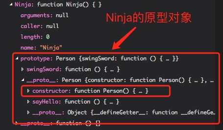
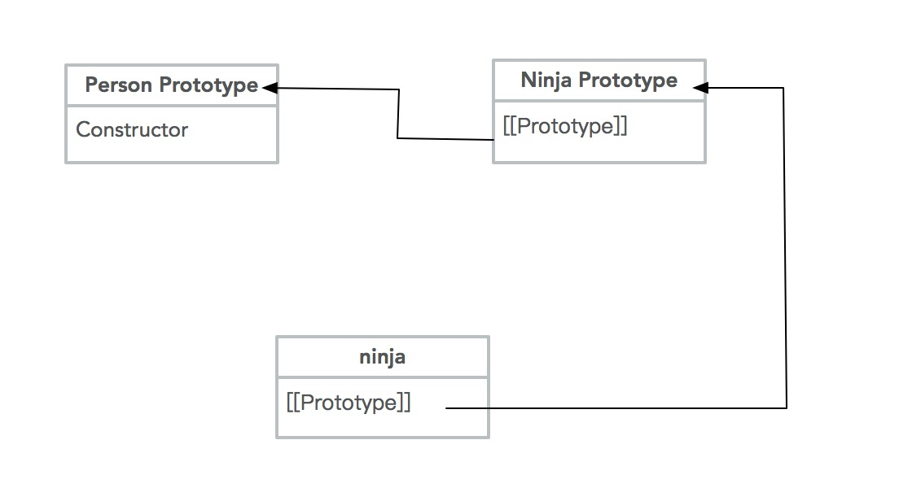

正如我们所知道的，JS 并非一门严格意义上的面向对象语言，但是它仍然具有对象的概念，且也有继承机制。但是这个继承也并非同传统面向对象语言那样。它没有 “子类 “和 “父类” 的概念，也没有 “类”（`class`）和 “实例”（`instance`）的区分，全靠一种很奇特的 “原型链”（`prototype chain`）模式，来实现继承。

> 事实上在ES6中，引入了 class 关键字，但是其本质上仍然是函数。

<!-- more -->

## 设计由来

JS 之所以有如此奇怪的语法，这些都是有历史渊源的，我们要从其设计之初讲起。

> 详见 [Javascript继承机制的设计思想](http://www.ruanyifeng.com/blog/2011/06/designing_ideas_of_inheritance_mechanism_in_javascript.html) 的第一二部分（推荐看一下），我们这里简述一下。

JS 在设计的时候，正好是面向对象语言最兴盛的时候，所以 JS 的设计者也受其影响，这一点在 **JS 的数据类型全是对象（包括函数）** 这一方面就能看出来。所以这就有一个问题了，作为一门数据类型全是对象的语言，究竟要不要 `继承` 这一特性呢？

如果想要用 C++、Java 那种继承方式，那势必要 `类(class)` 这一概念，这样就与其“简单、易用”设计的本意相违背，成了一门完全的面向对象语言了。

如果不要，又因为 JavaScript 里面都是对象，必须有一种机制，将所有对象联系起来。

所以 JS 的设计者想出了一种 既包含 `继承`，又不需要 `Class` 的方案：原型链。

## 1. 原型（prototype）

> JS 通过 原型对象 实现了面向对象中的类与实例对象的关系。

只要创建了一个函数，就会为这个函数创造一个原型（`prototype`）属性（这个属性指向的就是原型对象）。

在默认情况下，所有的原型对象都会自动包含一个隐藏属性：`constructor`，这个属性指向的就是 `prototype` 属性所在函数（即 原型对象的构造函数）。

```
(以自定义一个 Ninja() 函数为例)
|—— Ninja 函数					// 即 构造函数
| |—— Prototype 对象			// 即 原型对象
| | |—— constructor 属性		// 指向 Ninja 函数
```

再来个代码的栗子🌰：

```javascript
function Ninja() { }

console.log(Ninja.prototype)                // 输出：Ninja {}
console.log(Ninja.prototype.constructor)    // 输出：[Function: Ninja]
```

> 这是 Node.js 环境下的编译器输出，所以输出为：`Ninja {}`，但是如果是在 web浏览器中输出，那么结果如下：`Object {constructor: function}`
>
> 建议在打断点查看详情，这样两者都能很好地展示结果。

### 1.1. 实例对象

当调用构造函数创建实例的时候，实例内部将包含一个指针（即 `[[Prototype]]` 属性），指向原型对象。但是这个 `[[Prototype]]` 属性是无法访问的，所以几个 JS 引擎就实现了一个称为 `__proto__` 的不可见自定义属性，以此来访问 `[[Prototype]]` 属性所指向的原型对象。

**一定要注意**区分这里的所说的构造函数 和 面向对象中构造函数，不要混为一谈。这里的构造函数就是指 当 `new` 这个函数的时候，会创造一个新的实例对象。

> 值得注意的是：`__proto__`对 `[[Prototype]]` 的连接存在于实例与构造函数的原型对象之间，而非实例与构造函数之间。

让我们看一个栗子🌰：

```javascript
function Ninja() {
    this.swingSword = function() {
        return true;
    }
}

var ninja = new Ninja()
console.log(ninja.swingSword())		// 输出：true
console.log(ninja.__proto__)		// 输出：[Function: Ninja]
```

> 并不推荐使用 `__proto__`，且ES6 中已经有了良好的替代方法，详情请见本文 1.3 节。

### 1.2. 原型上方法的优先级

当构造函数的内部函数和原型上的函数重名的时候，构造函数的内部函数会屏蔽原型上的函数。

看一个简单的例子：

```javascript
function Person() {
    this.sayHello = function () {
        return "Hi"
    }
}

Person.prototype.sayHello = function () {
    return "Hello"
}

var person = new Person()
console.log(person.sayHello())       // 输出：Hi
```

### 1.3. `__proto__`

> 摘录自 `Understanding ES6`

在 ES5 规范完成之前，几个 JS 引擎就已经实现了一个称为 `__proto__` 的自定义属性，能用它来获取并设置 `[[Prototype]]` 属性。

实际上， **__proto__ 就是 Object.getPrototypeOf() 与 Object.getPrototypeOf() 方法的早期先驱**。期望所有的 JS 引擎都移除这个属性是不现实的（因为有些流行的 JS 代码库已经利用了该属性），因此 ES6 也将该属性的行为标准化了，但在 ECMA-262 附录 B 中该规范也附带了以下警告：

> 这些特性并不被认为是 ES 语言的核心部分，程序员在书写新的 ES 代码时，不应使用 它、或假定这些特性存在。 ES 的实现方案并不鼓励实现这些特性，除非该实现已是 web 浏览器的一部分、或者被用于在浏览器中运行遗留代码。

**ES 规范更推荐使用 Object.getPrototypeOf() 与 Object.setPrototypeOf() 方法，因为 __proto__ 具有如下特征：**

1. 在对象字面量中只能指定一次，指定多个对象字面量属性中唯一受此限制的属性。 
2. 对象字面量中需计算形式的 [“`__proto__`“] 表现得就像是常规属性，并不会设置或返回 当前对象的原型。对于字面量属性来说，需计算形式与非计算形式一般是等价的，只有 `__proto__` 例外。

```javascript
let a1 = {
	["__proto__"]: Number
};
console.log(a1)		// 输出：{ __proto__: [Function: Number] }

let a2 = {
	__proto__: Number
};
console.log(a2)		// 输出：Function {}
```

我们可以看出，a1 与 a2 完全是不一样的，a1 是对象，a2 则是函数。

## 2. 原型链

上面我们提到，构造函数、原型对象、实例对象这三个重要的概念。让我们重新理一理这三者的关系。

**构造函数包含一个原型对象，原型对象包含一个指向构造函数的指针（constructor属性），实例对象包含一个指向构造函数原型对象的指针（[[Prototype]]属性）。**

同时，我们知道原型对象就是一个对象，它可以是任何对象。所以当原型对象指向的是另一个类型的实例对象时，是不是间接实现了继承。

```javascript
function Person() { }			// 父函数

function Ninja() { }			// 子函数

Ninja.prototype = new Person()		// 设置子函数的原型为父函数的一个实例对象

console.log(Ninja.prototype instanceof Person)                  // 输出1：true
console.log(Ninja.prototype.constructor)                        // 输出2 ：[Function: Person]
console.log(Ninja.prototype.__proto__ === Person.prototype)     // 输出3：true

var ninja = new Ninja()
console.log(ninja.__proto__ === Ninja.prototype)        // 输出4：true
console.log(ninja.__proto__ === Person.prototype)       // 输出5：false
```

1. 输出1：因为我们把`Ninja`构造函数的原型对象设置为了 `Person` 的一个实例对象，所以输出True；
2. 输出2：**因为把 Ninja 原型对象设置为了 Person 的一个实例对象之后，Ninja 原型对象中的 constructor属性 会消失。因为此时的 Ninja构造函数的原型对象是一个实实在在的实例对象，而实例对象是没有 constructor 属性的。**此时输出的实际上是 `Person.prototype.constructor`。（原型链的特性，当没有一个属性的时候，会顺着原型链往上找）。
3. 输出3：因为 `Ninja` 原型对象是 `Person` 的一个实例对象，所以其 `__proto__` 指向的就是 `Person.prototype`。
4. 输出4、5：`ninja` 到底是 `Ninja` 的实例对象，所以其 `__proto__` 指向的就是 `Ninja.prototype`。

下面这是 Ninja 对象，可以仔细看下：



[原型链之 Ninja 对象](http://huanqiang.wang/img/JavaScript/PrototypeChain_code.png)

下面是结构图： 



[原型链之 Ninja 对象](http://huanqiang.wang/img/JavaScript/PrototypeChain_Struct.png)

> 我这里写的比较乱，如果还没有看懂的，请看《JavaScript 高级程序设计》。很重要

### 2.2. 属性继承

> 这是我自己给的命名，大概就是这个意思吧；

在原型搜索机制中，当访问一个实例对象的实力属性时，它首先会在实力本身中去搜索，如果没有搜索到，它就会跑到其原型中去搜索。

同样的，在运用了原型链之后，如果其原型中仍然没有，就会顺着原型链继续往上找。让我们看下面的例子：

```javascript
function Person() { }

Person.prototype.sayHello = function () {
    return "Hello"
}

function Ninja() { }

Ninja.prototype = new Person()
Ninja.prototype.swingSword = function () {
    return true;
}

var ninja = new Ninja()
console.log(ninja.swingSword())     // 输出：true
console.log(ninja.sayHello())       // 输出：Hello
```

在这个例子中，当我们访问 `ninja.swingSword()` 时，其步骤是这样的：

```javascript
ninja 本身的属性 —->  Ninja.prototype(Person的一个实例对象)
```

当我们访问 `ninja.sayHello()` 时，其步骤是这样的：

```
ninja 本身的属性 —->  Ninja.prototype --> Person.prototype
```

> 这里只是基础地讲解了下原型链，更加详细的内容请阅读：《JavaScript 高级程序设计》：第6章

## 资料

1. 《JavaScript 忍者秘籍》：第6章
2. 《JavaScript 高级程序设计》：第6章
3. [Javascript继承机制的设计思想](http://www.ruanyifeng.com/blog/2011/06/designing_ideas_of_inheritance_mechanism_in_javascript.html)：简单讲述了Javascript继承机制的设计思想；
4. [图解Javascript原型链](http://blog.rainy.im/2015/07/20/prototype-chain-in-js/)