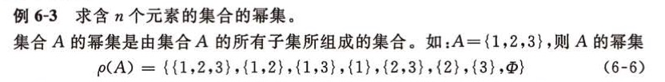
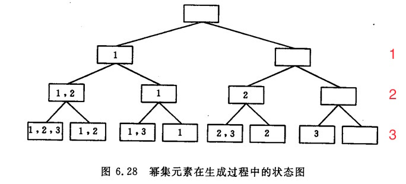
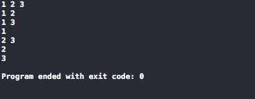
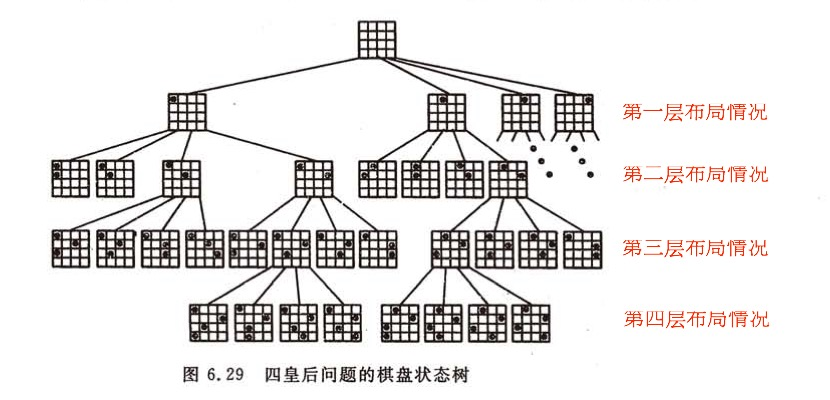
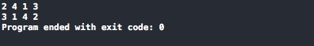

## 简介

回溯法（backtracking）是**暴力搜寻法**中的一种,具有“通用解题法”之称. 用该方法可以系统的去搜索一个问题的所有解或者任一解。其求解过程实质上是一个先序遍历一棵“状态树”的过程，只是这棵树不是遍历前预先建立的，而是隐含在遍历过程之中。

> 注意这里的“状态树”不是真正意思上的二叉树，而是一棵我们想象出来的结果二叉树。

<!-- more -->

## 解题思路

在包含问题的所有解的解空间树中，按照**深度优先策略**，从根节点出发搜索解空间树，总是先判断该节点是否肯定不包含问题的解。如果肯定不包含，则跳过对以该节点为根的子树的系统搜索，逐层向其祖先节点回溯。否则的话则进入该子树，继续按深度优先的策略进行搜索. 回溯法在用来求问题的所有解的时候,要回溯到根，且根节点的所有子树都以被搜索完毕才结束。

> 下面我们来看看例子：

## 例一：求幂集



[求幂集题目](http://huanqiang.wang/img/BackTracking/BackTracking_PowerSet.png)

首先，我们来分析一下问题。幂集的每个元素（成员）都是一个集合，它或是空集，或含集合A中的一个元素，或含集合A中的两个元素，或等于集合A。

反之，我们从集合A的每个元素来看，对于一个幂集的元素集只有两种状态：要么属于，要么不属于。

由此，我们可以把求幂集的元素的过程看成是依次对集合A中元素进行“取舍”的过程，并用以下二叉树表示：



[求幂级题目](http://huanqiang.wang/img/BackTracking/BackTracking_PowerSet_Answer.jpeg)

> 1. 第一层：取、舍元素1（左分支是取，右分支是舍）
> 2. 第二层：取、舍元素2
> 3. 第三层：取、舍元素3

### 核心代码

```c
void getPowerSet(int i, int n, int list[], int result[]) {
    if (i >= n) {
        // 输出一个幂集
        display(result);
    }else {
        // 获取第i个元素的值
        int x = getElm(i, list);
        int k = listLength(result);
        
        // 取 第i个元素
        insertElm(result, k, x);
        getPowerSet(i + 1, n, list, result);
        
        // 舍 第i个元素
        deleteElm(result, k);
        getPowerSet(i + 1, n, list, result);
    }
}
```

### 其他代码

```c
int getElm(int i, int *list) {
    return list[i];
}

int listLength(int *a) {
    int *list = a;
    int count = 0;
    
    for (; *list != 0; list++) {
        count++;
    }
    
    return count;
}

void insertElm(int list[], int k, int x) {
    list[k] = x;
}

void deleteElm(int list[], int k) {
    list[k] = 0;
}

void display(int *a) {
    int *list = a;
    
    for (; *list != 0; list++) {
        printf("%d ", *list);
    }
    printf("\n");
}
```

### 测试代码

```c
int main(int argc, const char * argv[]) {
    // insert code here...
    
    
    int listA[4] = {1, 2, 3, 0};
    int listB[4] = {0, 0, 0, 0};
    
    getPowerSet(0, 3, listA, listB);
    
    
    return 0;
}
```

### 测试结果



[求幂级测试结果](http://huanqiang.wang/img/BackTracking/BackTracking_PowerSet_TestAnswer.png)

## 例二：4皇后问题

N皇后问题是使用回溯法的重要例子，我们这里为了方便就仅使用4皇后问题。

首先，让我们同上例一样画出可能结果的状态二叉树，如下图：



[4皇后问题结果二叉树](http://huanqiang.wang/img/BackTracking/BackTracking_FourQueen_Answer.png)

> 1. 树上的每一个结点表示一个一次落子（即一次布局）。
> 2. 根节点表示棋盘的初始状态：棋盘上无任何棋子。
> 3. 在每一层中，皇后都有4种可选状态。
> 4. 在任何时刻，棋盘上的皇后都必须满足其约束条件。

### 核心代码

```c
void backTrack(int *list, int i) {
    if (i > N) {
        display(list);
    }else {
        for (int j = 1; j <= N; j++) {
            // 判断当前点是否和之前的各点相冲突，不冲突即加入list，冲突就忽略
            if (isAccord(list, j, i)) {
                list[i] = j;        // 加入当前点
                backTrack(list, i + 1);
                
                // 因为已经走过了当前点，所以进行处理下一个点，这就必须要删除当前点
                // 这里我们 用list[i] = 0;表删除
                list[i] = 0;        // 删除当前点，继续循环
            }
        }
    }
}

// 判断 是否符合约束条件
// row 为当前列, line 为当前行
int isAccord(int *list, int row, int line) {

    for (int i = 1; i < line; i++) {
        /* 
         这里是关键：即如何判断各点冲突
            1. 首先这里不可能出现行冲突（因为我们使用了按行递归）
            2. 判断列冲突：用 list 数组中的每行的列值和当前列比较，相同即冲突
            3. 对角线冲突：用两行差和两列差的绝对值比较，相等即冲突
         */
        if (list[i] == row || list[i] - row == i - line || list[i] - row == line - i) {
            return NO;
        }
    }
        
    return YES;
}
```

### 其他辅助函数

```c
void display(int list[]) {
    for (int i = 1; i <= N; i++) {
        printf("%d ", list[i]);
    }
    
    printf("\n");
}
```

### 测试函数

```C
#define N 4
#define YES 1
#define NO 0

void backTrack(int *list, int i);

int main(int argc, const char * argv[]) {
    // insert code here...
    
    // 这里的list数组的下标表示行，里面的值表示列
    // 如list[2] = 3：表示第2行第3列上有皇后棋子
    int list[N+1];
    
    backTrack(list, 1);
    
    return 0;
}
```

### 测试结果



[4皇后问题测试结果](http://huanqiang.wang/img/BackTracking/BackTracking_FourQueen_TestAnswer.png)

## 参考资料

> 1. [五大常用算法之四：回溯法](http://www.cnblogs.com/steven_oyj/archive/2010/05/22/1741376.html)
> 2. [回溯法入门](http://blog.csdn.net/m6830098/article/details/17596529)